<hr>
<center>
<h2>
Project 2
</h2>
</center>
<hr>

# Loading Initial Packages For Cleaning:

<hr>

``` r
#install.packages('janitor')
#install.packages('aplore3')

library(aplore3) # for our dataset
library(tidyverse) # tools for viz/cleaning/etc
library(janitor) # tools for cleaning
library(visdat) # visualize our missing data
```

<hr>

# Data Inspection

<hr>

Takeaways:

- Looking at the data we see that some of the weight values(in KG) are
  very low. assuming the low weight belongs to individuals who are
  older, maybe bed ridden, and have instances of sarcopenia this is
  plausible… but also it’s good to keep this in mind moving forward.

- raterisk: This is a completely subjective topic. maybe interesting to
  see, but not expected that this will provide much insight.

- Duplicate data: There is instances of duplicated data in the site_id,
  phy_id. This makes sense since many sites will occur with repeating
  metrics and many physicians will also occur with those same metrics.

- smoke has a very small sample of “Yes” (35)

``` r
# adding dataset into df call.
df <- glow_bonemed  

# looking at our data from afar 
#glimpse(df) # alot of categorical vars (factor encoding)

# for a look at a brief data description uncomment lines below:
#?glow_bonemed 
#?glow500


# check for duplicated data
# get_dupes(df, sub_id) # no duplicated data here which is what we'd like to see. 
# get_dupes(df, site_id) # makes sense that we would have duplicated study sites.
# get_dupes(df, phy_id) # makes sense that we would have duplicated physician id codes.

# check for missing values
#vis_miss(df) # great! No missing values. 

# visualizing the summary of our data. 
#summary(df)
```

<hr>
<center>
<h2>
EDA
</h2>
</center>
<hr>

# EDA - Categorical

Step one: Visualize what the Yes/Nos look like in terms of fractures.

- The plot below will show us without yet incorporating predictors, what
  is the percentages of yes/no that we are seeing in the data.

- Findings are that it’s not a very balanced split. 75% of the data have
  NO for fracture. when we make predictive probabilities how will this
  influence the result? will we find that they are around this value
  with some higher/lower? *potential sanity check to our results later*

- Additional Note… Unbalanced data is OK.. this should be revisted in
  our thresholding

``` r
library(ggplot2)
library(gridExtra)

c <- df %>% # allows us to gather table of y/n fracture, the cnt, and percent. 
  group_by(fracture) %>% 
  summarise(cnt = n()) %>% 
  mutate(perc=round(cnt/sum(cnt),4))

#c # shows the result of the above

# bar plot visual of the above. 
p<- ggplot(c, aes(x = fracture, y = perc, colour = fracture)) + 
  geom_bar(aes(fill = fracture), show.legend = F, stat = 'identity') +
  ylab('Proportion of Fracture') + xlab("Fracture") +
  geom_text(aes(label = paste0(perc *100, "%")), vjust = 2, size = 5, color = 'black')
```

Fracture - Menopause before age 45

- When and individual did not have menopause before age 45
  (pre-menopause) the chances of having a fracture are much higher even
  though there is only a 25% of having a fracture.

- If you are in the no premenopause group, it is approx 80% chance that
  you have a fracture. it decreases as for those who did have
  premenopause.

``` r
c1 <- df %>% 
  group_by(fracture, premeno) %>% 
  summarise(cnt=n()) %>% 
  mutate(perc=round(cnt/sum(cnt),4))%>% 
  arrange(desc(perc))

#c1

p1<- ggplot(c1[c(2,3),], aes(x = reorder(premeno, -perc), y = perc, colour = premeno))+
  geom_bar(aes(fill = premeno), show.legend = F, stat = 'identity') + 
  ylab('Proportion of Fracture') +
  xlab('Menopause before age 45')+
  geom_text(aes(label = paste0(perc *100, "%")), vjust = 2, size = 5, color = 'black')
```

Fracture - momfrac (mother had hip fracture)

- When an individual did not have a mother that had a hip fracture the
  chances of having a fracture are much higher (80.8%) even though there
  is only a 25% of having a fracture.

- If an individual is in the “Mother did not have a hip fracture” group,
  there is an 80.8% chance that you will have a fracture. This decreases
  for those who did have a mother with a hip fracture.

``` r
c2 <- df %>% 
  group_by(fracture, momfrac) %>%
  summarise(cnt=n()) %>% 
  mutate(perc = round(cnt/sum(cnt),4)) %>%
  arrange(desc(perc))

#c2

p2<- ggplot(c2[c(2,3),], aes(x = reorder(momfrac, -perc), y = perc, color = momfrac)) + 
  geom_bar(aes(fill = momfrac), show.legend = F, stat = 'identity') + 
  ylab('Proportion of Fracture') + 
  xlab("Mother had Hip fracture") + 
  geom_text(aes(label = paste0(perc * 100, "%")), vjust = 2, size = 5, color = "black")
```

Fracture - smoke (current or former smoker)

- When an individual falls in the category of former/current smoker the
  chances of having a fracture are much higher(94.4%) even though there
  is only a 25% of having a fracture.

``` r
c3 <- df %>% 
  group_by(fracture, smoke) %>%
  summarise(cnt=n()) %>% 
  mutate(perc = round(cnt/sum(cnt),4)) %>%
  arrange(desc(perc))

#c3

p3<- ggplot(c3[c(1,4),], aes(x = reorder(smoke, -perc), y = perc, color = smoke)) + 
  geom_bar(aes(fill = smoke), show.legend = F, stat = 'identity') + 
  ylab('Proportion of Fracture') + 
  xlab("Former/Current Smoker") + 
  geom_text(aes(label = paste0(perc * 100, "%")), vjust = 1, size = 5, color = "black")
```

fracture - raterisk (self-reported risk of fracture: classified by the
following groups…less than others of same age, same as others of same
age, greater than others of same age)

- An issue with this is that it’s a very subjective measure. WHY are
  they rating this? is it based off non-inclusive criteria that the
  physician provided? is it based on their own physical comparison with
  peers? is it simply low-self esteem/ high self esteem? I would imagine
  that from a predictive model stand point this is NOT something that
  should be included.

``` r
c4 <- df %>% 
  group_by(fracture, raterisk) %>%
  summarise(cnt=n()) %>% 
  mutate(perc = round(cnt/sum(cnt),4)) %>%
  arrange(desc(perc))

#c4

p4<- ggplot(c4[c(1,2,6),], aes(x = reorder(raterisk, -perc), y = perc, color = raterisk)) + 
  geom_bar(aes(fill = raterisk), show.legend = F, stat = 'identity') + 
  ylab('Proportion of Fracture') + 
  xlab("Self-Risk-Score") + 
  geom_text(aes(label = paste0(perc * 100, "%")), vjust = 2, size = 4, color = "black")
```

fracture - bonemed (bone medications at enrollment)

- When an individual is in the category of No medication at enrollment
  the chances of having a fracture are much higher(63.2%) even though
  there is only a 25% of having a fracture.

``` r
c5 <- df %>% 
  group_by(fracture, bonemed) %>%
  summarise(cnt=n()) %>% 
  mutate(perc = round(cnt/sum(cnt),4)) %>%
  arrange(desc(perc))

#c5

p5<- ggplot(c5[c(2,3),], aes(x = reorder(bonemed, -perc), y = perc, color = bonemed)) + 
  geom_bar(aes(fill = bonemed), show.legend = F, stat = 'identity') + 
  ylab('Proportion of Fracture') + 
  xlab("Medication at Enrollment") + 
  geom_text(aes(label = paste0(perc * 100, "%")), vjust = 2, size = 5, color = "black")
```

fracture - bonemed_fu (bone medications at follow-up)

- When an individual is in the category of No medication at Follow-up
  the chances of having a fracture are higher(57.6% vs 42.4%) even
  though there is only a 25% of having a fracture.

``` r
c6 <- df %>% 
  group_by(fracture, bonemed_fu) %>%
  summarise(cnt=n()) %>% 
  mutate(perc = round(cnt/sum(cnt),4)) %>%
  arrange(desc(perc))

#c6

p6<-ggplot(c6[c(2,3),], aes(x = reorder(bonemed_fu, -perc), y = perc, color = bonemed_fu)) + 
  geom_bar(aes(fill = bonemed_fu), show.legend = F, stat = 'identity') + 
  ylab('Proportion of Fracture') + 
  xlab("Medication at Follow-up") + 
  geom_text(aes(label = paste0(perc * 100, "%")), vjust = 2, size = 5, color = "black")
```

Fracture - bonetreat (bone medications both at enrollment and follow-up)

- When an individual is in the category of No treatment at both
  enrollment and follow-up the chances of having a fracture are much
  higher(68% vs. 32%) even though there is only a 25% of having a
  fracture.

``` r
c7 <- df %>% 
  group_by(fracture, bonetreat) %>%
  summarise(cnt=n()) %>% 
  mutate(perc = round(cnt/sum(cnt),4)) %>%
  arrange(desc(perc))

#c7

p7<-ggplot(c7[c(2,3),], aes(x = reorder(bonetreat, -perc), y = perc, color = bonetreat)) + 
  geom_bar(aes(fill = bonetreat), show.legend = F, stat = 'identity') + 
  ylab('Proportion of Fracture') + 
  xlab("Treatment: Enrollment & Follow-up") + 
  geom_text(aes(label = paste0(perc * 100, "%")), vjust = 2, size = 5, color = "black")
```

Fracture - Arms are needed to stand from a chair

- Very balanced between the two groups.

- When an individual is in the category of needing assistance to stand
  the chances of having a fracture are higher(50.4% vs 49.6%) even
  though there is only a 25% of having a fracture.

``` r
c8 <- df %>% 
  group_by(fracture, armassist) %>% 
  summarise(cnt=n()) %>% 
  mutate(perc=round(cnt/sum(cnt),4))%>% 
  arrange(desc(perc))

#c8

p8<- ggplot(c8[c(2,3),], aes(x = reorder(armassist, -perc), y = perc, colour = armassist))+
  geom_bar(aes(fill = armassist), show.legend = F, stat = 'identity') + 
  ylab('Proportion of Fracture') +
  xlab('Assistance to Stand')+
  geom_text(aes(label = paste0(perc *100, "%")), vjust = 2, size = 5, color = 'black')
```

fracture - priorfrac (history of prior fracture)

- When an individual is in the category of NOT having had a prior
  fracture the chances of having a fracture are higher(58.4% vs 41.6%)
  even though there is only a 25% of having a fracture.

``` r
c9 <- df %>% 
  group_by(fracture, priorfrac) %>%
  summarise(cnt=n()) %>% 
  mutate(perc = round(cnt/sum(cnt),4)) %>%
  arrange(desc(perc))

#c9

p9<-ggplot(c9[c(2,3),], aes(x = reorder(priorfrac, -perc), y = perc, color = priorfrac)) + 
  geom_bar(aes(fill = priorfrac), show.legend = F, stat = 'identity') + 
  ylab('Proportion of Fracture') + 
  xlab("Prior Fracture") + 
  geom_text(aes(label = paste0(perc * 100, "%")), vjust = 2, size = 5, color = "black")
```

Fracture - bmi - body mass index

- Some domain expertise here: there is evidence that individuals who are
  heavier tend to have less instances of osteoperosis, and hip/bone
  fractures. this is unsuprising to see here and is a good depiction of
  prior research.

- Including this variable into the model should be something that is
  significat based on the trend we see, although the instance of
  “underwieght” is interesting and may require some investigation.

- When an individual is in the category “Healthy Weight” the chances of
  having a fracture are highest (35.2%), followed by Overweight (32.8%),
  followed by Obesity(30.4%), and lastly Underweight (1.6%).

``` r
# transforming numeric into categorical using widley accepted BMI categories
df$bmi.cat <- ifelse(df$bmi < 18.5, "Underweight", 
                              ifelse(df$bmi < 25, "Healthy weight",
                                     ifelse(df$bmi < 30, "Overweight", "Obesity")))

c10 <- df %>% 
  group_by(fracture, bmi.cat) %>% 
  summarise(cnt=n()) %>% 
  mutate(perc=round(cnt/sum(cnt),4))%>% 
  arrange(desc(perc))

#c10

p10<- ggplot(c10[c(2,3,5,8),], aes(x = reorder(bmi.cat, -perc), y = perc, colour = bmi.cat))+
  geom_bar(aes(fill = bmi.cat), show.legend = F, stat = 'identity') + 
  ylab('Proportion of Fracture') +
  xlab('BMI Categories')+
  geom_text(aes(label = paste0(perc *100, "%")), vjust = 1, size = 4, color = 'black')
```

<hr>

# Visualizing “Important” Categorical Predictors

<hr>

``` r
grid.arrange(p,p1,p2,p3,p4,
             heights = c(1,1))
```


``` r
grid.arrange(p5,p7,p10,
             heights = c(1,1),
             widths = c(1,1,1.6))
```

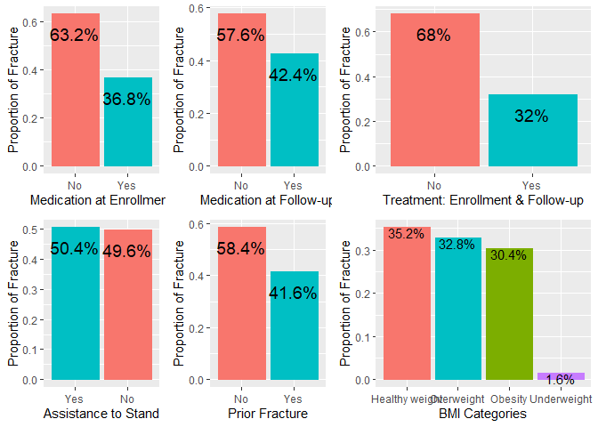

<hr>

# EDA - Numerical

<hr>

We would like to look at some of the relationships for the numerical
categories in our data. Before we can do this it is important for us to
create a numerical category for fracture so that we can create our LOESS
plot.

- Note to smooth the curve out some, we can use span values (such as
  1.25), either way this is artificial humps and bumps, try not to pay
  attention to the overall movements and look instead at the
  trend/association of how the data moves with increasing/decreasing
  values.

- Note for complex models We can add categorical values to this
  (interactions) \| also facet wrapping will allow us to view them
  separate.

``` r
# numercial form of fracture
df$fracture.num <- ifelse(df$fracture == "Yes",1,0) # Yes = 1 | No = 0
```

LOESS phy_id:

- No significance here

``` r
lp <- df %>% ggplot(aes(x = phy_id, y = fracture.num)) + 
  geom_point() + ggtitle("LOESS: Phy_ID")+
  geom_smooth(method = "loess", size = 1) + ylim(-.2, 1.2)
```

LOESS site_id:

- No significance here.

``` r
lp1<- df %>% ggplot(aes(x = site_id, y = fracture.num)) + 
  geom_point() + 
  geom_smooth(method = "loess", size = 1) + ylim(-.2, 1.2)+ ggtitle("LOESS: Site_id")
```

LOESS WEIGHT:

- No significance here

``` r
lp2<- df %>% ggplot(aes(x = weight, y = fracture.num)) + 
  geom_point() + 
  geom_smooth(method = "loess", size = 1) + ylim(-.2, 1.2)+ ggtitle("LOESS: Weight")
```

LOESS AGE:

- As age increases the is an increase in the chance of a fracture

``` r
lp3<- df %>% ggplot(aes(x = age, y = fracture.num)) +
  geom_point() +
  geom_smooth(method = "loess", size = 1) + ylim(-.2, 1.2)+ ggtitle("LOESS: Age")
```

LOESS HEIGHT:

- As Height decreases there is a decrease in the chance of a fracture

``` r
lp4<- df %>% ggplot(aes(x = height, y = fracture.num)) + 
  geom_point()+
  geom_smooth(method = "loess", size = 1) + ylim(-.2, 1.2)+ ggtitle("LOESS: Height")
```

LOESS fracscore (Fracture Risk Score (Composite Risk Score)):

- As the score increases there is an increase in the chance of a
  fracture.

``` r
lp5<- df %>% ggplot(aes(x = fracscore, y = fracture.num)) + 
  geom_point()+
  geom_smooth(method = "loess", size = 1) + ylim(-.2, 1.2)+ ggtitle("LOESS: fracscore")
```

``` r
lp6 <- df %>% ggplot(aes(x = bmi, fracture.num)) + 
  geom_point()+
  geom_smooth(method = 'loess', size = 1) + ylim(-.2,1.2) + ggtitle("Loess: BMI")
```

# Numerical Plots

``` r
grid.arrange(lp,lp1,lp2,ncol(2) )
```


``` r
grid.arrange(lp3,lp4,lp5,lp6,
             heights = c(1,1))
```


``` r
df %>% ggplot(aes(x = sub_id, y = fracture, color = fracture))+
  geom_point(show.legend = F)+ xlab("Identification Code") + ylab("Fracture")
```

<!-- -->

``` r
df %>% ggplot(aes(x = site_id, y = fracture, color = fracture))+
  geom_point(show.legend = F)+ xlab("Identification Code") + ylab("Fracture")
```

<!-- -->

``` r
df %>% ggplot(aes(x = bmi, y = fracture, color = fracture)) + 
  geom_point(show.legend = F)
```

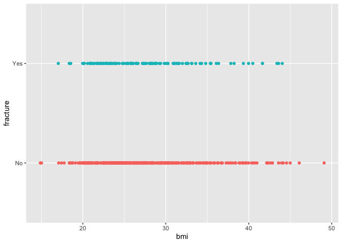<!-- -->

# Extra EDA

<h4>
Correlation Plot
</h4>

``` r
library(ggcorrplot)
library(GGally)
num.df <- df

# ordinal categorical into numerical
rr.mapping <- c(Less = -1,Same = 0,Greater=1)
num.df$raterisk.num <- as.numeric(rr.mapping[num.df$raterisk])


# create a dataframe that is only numerical
num.df <- num.df %>% select(where(is.numeric))

ggpairs(num.df, ggplot2::aes(color = as.factor(fracture.num)))
```


``` r
# remove irrelevant columns
num.df.adj <- num.df[,-c(1,2,3,9)]

# create correlation plot

# calling cor function to put into var. 
cor.data <- cor(num.df.adj)

# generate the plot
ggcorrplot(cor.data, outline.color = "black", lab = TRUE, title = 'Fracture Correlation Plot')
```

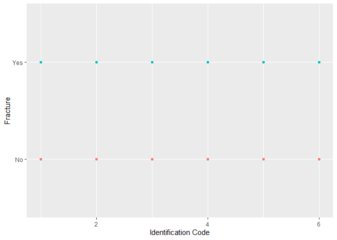

# Test/Validation Split

- Becuase we have such a small dataset we will use a training size of
  70% and test split of 30%. This is some what of a more aggressive
  split but should help to ensure we have an adequate amount of testing
  data.

``` r
library(caret)
set.seed(12)
trainIndex <- createDataPartition(df$fracture, p= .7, list = F) # p = proportion of data in train

training <- df[trainIndex,]
test <- df[-trainIndex,]

# sanity check
#nrow(training)
#nrow(test)
```

<hr>

# Objective 1

<hr>
<h4>
Fit Logistic Regression Model:
</h4>

- Note that the coefficients are LOG-ODDS and not ratios.. to obtain
  ratios we must exp(coef)

<h4>
Base Additive Model:
</h4>

- To begin we created a model with nearly every predictor so that we
  could see at a baseline what was significant and what was not (while
  in the presence of other variables)

- ANOVA: In the presence of other variables, variables such as
  priorfrac, age, bmi(right on the cusp of rejection), raterisk(on
  cusp), and bonetreat are significant, while the other feats. in the
  model are not significant at the .05 level of significance.

- The reasoning for keeping bmi in the model is because there is
  evidence in scientific literature that different classes of BMI tend
  to have different levels of susceptibility to osteoporosis and thus
  bone fractures.

- AIC of our base.model is 393.24 (no)

# Model 1 Additive

``` r
library(ResourceSelection)
library(car)

# removing sub_id, raterisk, fracture.num
adj.training <- training[,-c(1,20)]
#colnames(adj.training) #sanity check

base.model <- glm(fracture~., family = "binomial", data = adj.training)

summary(base.model)
```

    ## 
    ## Call:
    ## glm(formula = fracture ~ ., family = "binomial", data = adj.training)
    ## 
    ## Deviance Residuals: 
    ##     Min       1Q   Median       3Q      Max  
    ## -1.7372  -0.7398  -0.5579   0.1855   2.3408  
    ## 
    ## Coefficients:
    ##                      Estimate Std. Error z value Pr(>|z|)  
    ## (Intercept)        -36.449863  16.560141  -2.201   0.0277 *
    ## site_id              0.229749   0.337510   0.681   0.4961  
    ## phy_id              -0.002464   0.005256  -0.469   0.6392  
    ## priorfracYes         0.196718   0.497197   0.396   0.6924  
    ## age                 -0.030071   0.071088  -0.423   0.6723  
    ## weight              -0.241111   0.113134  -2.131   0.0331 *
    ## height               0.219031   0.105740   2.071   0.0383 *
    ## bmi                  0.614298   0.293182   2.095   0.0361 *
    ## premenoYes           0.238419   0.350344   0.681   0.4962  
    ## momfracYes           0.081783   0.540494   0.151   0.8797  
    ## armassistYes        -0.560360   0.769431  -0.728   0.4664  
    ## smokeYes            -0.317471   0.642038  -0.494   0.6210  
    ## rateriskSame         0.101082   0.340661   0.297   0.7667  
    ## rateriskGreater      0.599688   0.360287   1.664   0.0960 .
    ## fracscore            0.357711   0.358842   0.997   0.3188  
    ## bonemedYes           1.234037   0.770430   1.602   0.1092  
    ## bonemed_fuYes        1.157198   0.622433   1.859   0.0630 .
    ## bonetreatYes        -1.890671   1.004065  -1.883   0.0597 .
    ## bmi.catObesity       0.730621   0.754811   0.968   0.3331  
    ## bmi.catOverweight    0.645398   0.428918   1.505   0.1324  
    ## bmi.catUnderweight  -1.783950   1.251188  -1.426   0.1539  
    ## ---
    ## Signif. codes:  0 '***' 0.001 '**' 0.01 '*' 0.05 '.' 0.1 ' ' 1
    ## 
    ## (Dispersion parameter for binomial family taken to be 1)
    ## 
    ##     Null deviance: 395.31  on 350  degrees of freedom
    ## Residual deviance: 351.24  on 330  degrees of freedom
    ## AIC: 393.24
    ## 
    ## Number of Fisher Scoring iterations: 4

``` r
# anova 
anova(base.model, test = "Chisq")
```

    ## Analysis of Deviance Table
    ## 
    ## Model: binomial, link: logit
    ## 
    ## Response: fracture
    ## 
    ## Terms added sequentially (first to last)
    ## 
    ## 
    ##            Df Deviance Resid. Df Resid. Dev  Pr(>Chi)    
    ## NULL                         350     395.31              
    ## site_id     1   2.1235       349     393.18 0.1450577    
    ## phy_id      1   0.5200       348     392.66 0.4708518    
    ## priorfrac   1  12.3405       347     380.32 0.0004432 ***
    ## age         1   5.0088       346     375.31 0.0252191 *  
    ## weight      1   0.3891       345     374.93 0.5327964    
    ## height      1   0.2076       344     374.72 0.6486913    
    ## bmi         1   3.8079       343     370.91 0.0510128 .  
    ## premeno     1   0.6783       342     370.23 0.4101767    
    ## momfrac     1   1.9663       341     368.27 0.1608453    
    ## armassist   1   0.1683       340     368.10 0.6816214    
    ## smoke       1   0.0043       339     368.09 0.9478771    
    ## raterisk    2   5.1360       337     362.96 0.0766902 .  
    ## fracscore   1   0.1122       336     362.85 0.7376670    
    ## bonemed     1   2.2778       335     360.57 0.1312383    
    ## bonemed_fu  1   1.0554       334     359.51 0.3042747    
    ## bonetreat   1   3.8861       333     355.63 0.0486885 *  
    ## bmi.cat     3   4.3898       330     351.24 0.2223324    
    ## ---
    ## Signif. codes:  0 '***' 0.001 '**' 0.01 '*' 0.05 '.' 0.1 ' ' 1

<h4>
Base Adj. Model:
</h4>

- Taking what was significant in our first model (base.model) we will
  now add it to our second model (base.adj) model and compare it’s
  performance to determine which provides a better fit.

- base.adj model removes 6 predictors that were in the base.model and
  yields a slightly improved AIC of 383.12 compared to base.model AIC
  393.24

- The p-value from our anova of 0.212 \> .05 suggests that the
  difference in deviance between the two models is not statistically
  significant. This means that we fail to reject the null hypothesis and
  cannot conclude that Model 1 fits the data significantly better than
  Model 2, even though it has more predictors. We will proceed with
  Model 2 (base.adj model)

# Model 2 Additive

``` r
base.adj <- glm(fracture~priorfrac+age+bmi+raterisk+bonetreat, data = training, family = "binomial")

summary(base.adj)
```

    ## 
    ## Call:
    ## glm(formula = fracture ~ priorfrac + age + bmi + raterisk + bonetreat, 
    ##     family = "binomial", data = training)
    ## 
    ## Deviance Residuals: 
    ##     Min       1Q   Median       3Q      Max  
    ## -1.4225  -0.7558  -0.6106   0.2185   2.1509  
    ## 
    ## Coefficients:
    ##                 Estimate Std. Error z value Pr(>|z|)    
    ## (Intercept)     -5.27559    1.36740  -3.858 0.000114 ***
    ## priorfracYes     0.52570    0.29253   1.797 0.072321 .  
    ## age              0.04025    0.01536   2.620 0.008799 ** 
    ## bmi              0.03119    0.02233   1.397 0.162405    
    ## rateriskSame     0.14452    0.32675   0.442 0.658270    
    ## rateriskGreater  0.71971    0.33688   2.136 0.032645 *  
    ## bonetreatYes     0.34277    0.31303   1.095 0.273521    
    ## ---
    ## Signif. codes:  0 '***' 0.001 '**' 0.01 '*' 0.05 '.' 0.1 ' ' 1
    ## 
    ## (Dispersion parameter for binomial family taken to be 1)
    ## 
    ##     Null deviance: 395.31  on 350  degrees of freedom
    ## Residual deviance: 369.12  on 344  degrees of freedom
    ## AIC: 383.12
    ## 
    ## Number of Fisher Scoring iterations: 4

``` r
# anova comparing both models 
anova(base.model,base.adj,test = "Chisq")
```

    ## Analysis of Deviance Table
    ## 
    ## Model 1: fracture ~ site_id + phy_id + priorfrac + age + weight + height + 
    ##     bmi + premeno + momfrac + armassist + smoke + raterisk + 
    ##     fracscore + bonemed + bonemed_fu + bonetreat + bmi.cat
    ## Model 2: fracture ~ priorfrac + age + bmi + raterisk + bonetreat
    ##   Resid. Df Resid. Dev  Df Deviance Pr(>Chi)
    ## 1       330     351.24                      
    ## 2       344     369.12 -14  -17.887    0.212

``` r
# checking for multicollinearity issues. 
#vif(base.adj) #no issues present
```

<h4>
Simple (Additive) Model - Multiple Logistic Regression fit
</h4>

- There are some variables that were not included in the previous two
  models, but have either shown potential visually, or would make
  “sense” to have some effect on predicting fractures. These are
  included here in this simple (additive) model.

- We will take the same approach and start with this model then
  investigate it further to determine what is significant or what can be
  removed.

# Model 3 Additive

``` r
# fitting an additive multiple logistic regression model
simple <- glm(fracture ~ smoke + armassist + momfrac + premeno + bmi + height + age + bonemed + bonetreat + bonemed_fu, data = training, family ="binomial")

# looking at coefficients
(simple.summary<- summary(simple))
```

    ## 
    ## Call:
    ## glm(formula = fracture ~ smoke + armassist + momfrac + premeno + 
    ##     bmi + height + age + bonemed + bonetreat + bonemed_fu, family = "binomial", 
    ##     data = training)
    ## 
    ## Deviance Residuals: 
    ##     Min       1Q   Median       3Q      Max  
    ## -1.4899  -0.7572  -0.6106   0.2027   2.1570  
    ## 
    ## Coefficients:
    ##               Estimate Std. Error z value Pr(>|z|)  
    ## (Intercept)   -3.11140    4.09318  -0.760   0.4472  
    ## smokeYes       0.13156    0.51743   0.254   0.7993  
    ## armassistYes   0.30632    0.30181   1.015   0.3101  
    ## momfracYes     0.55555    0.35573   1.562   0.1184  
    ## premenoYes     0.33133    0.33827   0.979   0.3273  
    ## bmi            0.02481    0.02439   1.017   0.3091  
    ## height        -0.01156    0.02182  -0.530   0.5963  
    ## age            0.03784    0.01681   2.251   0.0244 *
    ## bonemedYes     1.32397    0.74640   1.774   0.0761 .
    ## bonetreatYes  -2.00434    0.97643  -2.053   0.0401 *
    ## bonemed_fuYes  1.42388    0.59856   2.379   0.0174 *
    ## ---
    ## Signif. codes:  0 '***' 0.001 '**' 0.01 '*' 0.05 '.' 0.1 ' ' 1
    ## 
    ## (Dispersion parameter for binomial family taken to be 1)
    ## 
    ##     Null deviance: 395.31  on 350  degrees of freedom
    ## Residual deviance: 366.66  on 340  degrees of freedom
    ## AIC: 388.66
    ## 
    ## Number of Fisher Scoring iterations: 4

``` r
# looking for Multicollinearity
#(simple.vif <- vif(simple))

# AIC metric can help us compare against models with interactions later to determine if the interactions are important or not. 
simple.AIC <- AIC(simple)

# ANOVA
anova(simple, test = "Chisq")
```

    ## Analysis of Deviance Table
    ## 
    ## Model: binomial, link: logit
    ## 
    ## Response: fracture
    ## 
    ## Terms added sequentially (first to last)
    ## 
    ## 
    ##            Df Deviance Resid. Df Resid. Dev Pr(>Chi)   
    ## NULL                         350     395.31            
    ## smoke       1   0.0166       349     395.29 0.897514   
    ## armassist   1   5.1213       348     390.17 0.023634 * 
    ## momfrac     1   1.9377       347     388.23 0.163915   
    ## premeno     1   0.0589       346     388.17 0.808250   
    ## bmi         1   0.0641       345     388.11 0.800110   
    ## height      1   2.0651       344     386.04 0.150703   
    ## age         1   7.7455       343     378.30 0.005385 **
    ## bonemed     1   5.5456       342     372.75 0.018527 * 
    ## bonetreat   1   0.5871       341     372.17 0.443546   
    ## bonemed_fu  1   5.5055       340     366.66 0.018957 * 
    ## ---
    ## Signif. codes:  0 '***' 0.001 '**' 0.01 '*' 0.05 '.' 0.1 ' ' 1

<h4>
Reducing the model predictors:
</h4>

- Reduction of the features is based only on what was deemed
  significant.

- The p-value from our anova of .1985 \> .05 suggests that the
  difference in deviance between the two models is not statistically
  significant. This means that we fail to reject the null hypothesis and
  cannot conclude that Simple model fits the data significantly better
  than red.model, even though it has more predictors. We will proceed
  with (red.model)

- The p-value from our anova of .08925 \> .05 suggests that the
  difference in deviance between the two models is not statistically
  significant. This means that we fail to reject the null hypothesis and
  cannot conclude that Base.adj fits the data significantly better than
  red.model, even though it has more predictors. We will proceed with
  “red.model” as our “best performing” in terms of ANOVA comparison, but
  will still reference and use the base.adj model.

- although the base.adj model doesn’t perform as well as the red.model,
  it’s features allow for real world applicability in predicting
  fractures. While it would be nice for most of the explanation to be
  summed up and accounted for over 4 variables the human body has many
  factors that can contribute to bone health such as hormones,
  lifestyle, activity level, etc. It is for these reasons that we will
  actually proceed with both models in hand as we look for the
  appropriate application.

# Model 4 Additive

``` r
red.model <- glm(fracture~ armassist+age+bonemed_fu+bonemed,
                 data = training,
                 family ="binomial")

# summary of coef. 
summary(red.model)
```

    ## 
    ## Call:
    ## glm(formula = fracture ~ armassist + age + bonemed_fu + bonemed, 
    ##     family = "binomial", data = training)
    ## 
    ## Deviance Residuals: 
    ##     Min       1Q   Median       3Q      Max  
    ## -1.3289  -0.7732  -0.6228   0.2660   2.0306  
    ## 
    ## Coefficients:
    ##                Estimate Std. Error z value Pr(>|z|)    
    ## (Intercept)   -3.716578   1.014492  -3.663 0.000249 ***
    ## armassistYes   0.444124   0.266632   1.666 0.095777 .  
    ## age            0.031982   0.014891   2.148 0.031732 *  
    ## bonemed_fuYes  0.735544   0.495698   1.484 0.137847    
    ## bonemedYes     0.007844   0.505190   0.016 0.987612    
    ## ---
    ## Signif. codes:  0 '***' 0.001 '**' 0.01 '*' 0.05 '.' 0.1 ' ' 1
    ## 
    ## (Dispersion parameter for binomial family taken to be 1)
    ## 
    ##     Null deviance: 395.31  on 350  degrees of freedom
    ## Residual deviance: 375.24  on 346  degrees of freedom
    ## AIC: 385.24
    ## 
    ## Number of Fisher Scoring iterations: 4

``` r
# AIC metric can help us compare against models with interactions later to determine if the interactions are important or not. 
red.aic <- AIC(red.model)

# looking for Multicollinearity
red.vif <- vif(red.model) # we do have a high VIF in bonetreat.

# Hosmer-Lemeshow test
red.hlt <- hoslem.test(red.model$y, fitted(red.model))

# ANOVA Comparison 
anova(simple, red.model, test = "Chisq") # FTR null : proceed with red.model
```

    ## Analysis of Deviance Table
    ## 
    ## Model 1: fracture ~ smoke + armassist + momfrac + premeno + bmi + height + 
    ##     age + bonemed + bonetreat + bonemed_fu
    ## Model 2: fracture ~ armassist + age + bonemed_fu + bonemed
    ##   Resid. Df Resid. Dev Df Deviance Pr(>Chi)
    ## 1       340     366.66                     
    ## 2       346     375.24 -6  -8.5816   0.1985

``` r
# ANOVA BASE.ADJ/RED
anova(base.adj,red.model,test = "Chisq") # FTR Null: proceed with red.model
```

    ## Analysis of Deviance Table
    ## 
    ## Model 1: fracture ~ priorfrac + age + bmi + raterisk + bonetreat
    ## Model 2: fracture ~ armassist + age + bonemed_fu + bonemed
    ##   Resid. Df Resid. Dev Df Deviance Pr(>Chi)  
    ## 1       344     369.12                       
    ## 2       346     375.24 -2  -6.1189  0.04691 *
    ## ---
    ## Signif. codes:  0 '***' 0.001 '**' 0.01 '*' 0.05 '.' 0.1 ' ' 1

# Interpretation of coefficients

<h4>
Red.Model
</h4>
<h4>
Base.Adj Model
</h4>

- Log-odds:

  - AGE: The positive coefficient of 0.0342221 indicates that for every
    one-unit increase in age, the log odds of having a fracture increase
    by 0.0342221, holding all other predictors constant. This predictor
    is statistically significant (p = 0.0267), meaning that age has a
    significant effect on the probability of fracture

  - PRIORFRAC(YES) The positive coefficient of 0.6183073 indicates that
    if a person has had a prior fracture (priorfrac = Yes), the log odds
    of having a fracture increase by 0.6183073, holding all other
    predictors constant. This predictor is also statistically
    significant (p = 0.0322), indicating that having a prior fracture
    increases the risk of having another fracture.

  - HEIGHT The coefficient of -0.0008537 suggests a very small negative
    relationship between height and the log odds of having a fracture,
    holding all other predictors constant. However, this predictor is
    not statistically significant (p = 0.9679), so we cannot conclude
    that height has an impact on the probability of a fracture.

  - MOMFRAC(YES) The positive coefficient of 0.5171833 indicates that if
    a person’s mother has had a fracture (momfrac = Yes), the log odds
    of having a fracture increase by 0.5171833, holding all other
    predictors constant. However, this predictor is not statistically
    significant (p = 0.1449), so we cannot conclude that having a mother
    with a fracture affects the probability of a fracture.

  - BONEMED(YES) The positive coefficient of 0.0169533 suggests a very
    small positive relationship between taking bone medication (bonemed
    = Yes) and the log odds of having a fracture, holding all other
    predictors constant. However, this predictor is not statistically
    significant (p = 0.9736), so we cannot conclude that taking bone
    medication has an impact on the probability of a fracture.

  - BMI The positive coefficient of 0.0332507 indicates that for every
    one-unit increase in BMI, the log odds of having a fracture increase
    by 0.0332507, holding all other predictors constant. However, this
    predictor is not statistically significant (p = 0.1372), so we
    cannot conclude that BMI has an impact on the probability of a
    fracture.

  - BONEMED_FU(YES) The positive coefficient of 0.6969686 indicates that
    if a person has follow-up bone medication (bonemed_fu = Yes), the
    log odds of having a fracture increase by 0.6969686, holding all
    other predictors constant. However, this predictor is not
    statistically significant (p = 0.1646), so we cannot conclude that
    follow-up bone medication has an impact on the probability of a
    fracture.

- Odds Ratios:

  - AGE The odds ratio for age is 1.0348 with a 95% confidence interval
    of \[1.0040, 1.0669\]. This means that for every one-unit increase
    in age, the odds of having a fracture increase by about 3.48%,
    holding all other predictors constant. The confidence interval
    suggests that the true odds ratio for age lies between 1.0040 and
    1.0669 with 95% confidence.

  - PRIORFRAC(YES) The odds ratio for priorfracYes is 1.8555 with a 95%
    confidence interval of \[1.0484, 3.2589\]. This means that if a
    person has had a prior fracture (priorfrac = Yes), the odds of
    having a fracture are about 1.8555 times higher than someone who
    hasn’t had a prior fracture, holding all other predictors constant.
    The confidence interval suggests that the true odds ratio for
    priorfracYes lies between 1.0484 and 3.2589 with 95% confidence.

  - HEIGHT The odds ratio for height is 0.9991 with a 95% confidence
    interval of \[0.9582, 1.0417\]. This means that for every one-unit
    increase in height, the odds of having a fracture decrease by about
    0.09%, holding all other predictors constant. However, as previously
    mentioned, the effect of height is not statistically significant.
    The confidence interval for the height odds ratio includes 1, which
    further supports the lack of a significant effect.

  - MOMFRAC(YES) The odds ratio for momfracYes is 1.6778 with a 95%
    confidence interval of \[0.8218, 3.3282\]. This means that if a
    person’s mother has had a fracture (momfrac = Yes), the odds of
    having a fracture are about 1.6778 times higher than someone whose
    mother hasn’t had a fracture, holding all other predictors constant.
    However, the effect of momfracYes is not statistically significant,
    as the confidence interval includes 1.

  - BONEMED(YES) The odds ratio for bonemedYes is 1.0171 with a 95%
    confidence interval of \[0.36596, 2.7755\]. This means that if a
    person is taking bone medication (bonemed = Yes), the odds of having
    a fracture are about 1.0171 times higher than someone who is not
    taking bone medication, holding all other predictors constant.
    However, the effect of bonemedYes is not statistically significant,
    as the confidence interval includes 1.

  - BMI The odds ratio for BMI is 1.0338 with a 95% confidence interval
    of \[0.9891, 1.0801\]. This means that for every one-unit increase
    in BMI, the odds of having a fracture increase by about 3.38%,
    holding all other predictors constant. However, the effect of BMI is
    not statistically significant, as the confidence interval includes
    1.

  - BONEMED_FU(YES) The odds ratio for bonemed_fuYes is 2.0075 with a
    95% confidence interval of \[0.7423, 5.4109\]. This means that if a
    person has follow-up bone medication (bonemed_fu = Yes), the odds of
    having a fracture are about 2.0075 times higher than someone who
    does not have follow-up bone medication, holding all other
    predictors constant. However, the effect of bonemed_fuYes is not
    statistically significant, as the confidence interval includes 1.

<h4>
Practical/Statistical Significance of Important Factors
</h4>

- Age and PriorFrac were found to be statistically significant at the
  alpha = .05 level of significance. This indicates that there is
  sufficient evidence to suggest that these predictors have a non-zero
  effect on the odds of having a fracture, and their relationship with
  the response variable is unlikely to be due to random chance.

- Practical Significance:

  - AGE: The odds of having a fracture increase by about 3.48%, holding
    all other predictors constant, for every one year increase in age.
    This suggests that on a practical level age is an important risk
    factor for fractures, and interventions aimed at reducing fracture
    risk should consider age as a key factor.

  - Prior Fracture: If a person had a prior fracture the odds of having
    a fracture are about 1.86 times higher, when holding all other
    predictors constant. From a practical standpoint this indicates that
    individuals with a history of fractures are at a significantly
    higher risk of experiencing another fracture. it’s important to
    identify and monitor such individuals to develop targeted
    interventions that can help mitigate this risk.

# Effect Plots

one at a time (Additive Reduced Model):

- Because we are working with an additive model, plotting one by one is
  ok to do without losing much information.

``` r
library(sjPlot)
library(sjmisc)
library(effects)

# effect plot
plot_model(red.model, type = "pred", terms = "armassist")
```


``` r
plot_model(red.model, type = "pred", terms= "bonemed_fu")
```


``` r
plot_model(red.model, type = "pred", terms = "bonemed")
```


``` r
plot_model(red.model, type = "pred",terms = "age")
```


``` r
# identifies all of the high-order terms in a model and returns a list of "eff" or "effpoly" objects.
all.effects <- allEffects(red.model)

# plots the effect plosts
plot(all.effects,multiline=T)
```


Effect Plot Combo:

- Provides an intuitive way to understand impact of each predictor on
  the outcome, while holding the other pred. constant.

``` r
# effect plot
plot_model(red.model, type = "pred", terms = c("bonemed","armassist"))
```


``` r
plot_model(red.model, type ="pred", terms = c("age","bonemed_fu"))
```


``` r
plot_model(red.model, type = "pred", terms = c("age","armassist"))
```

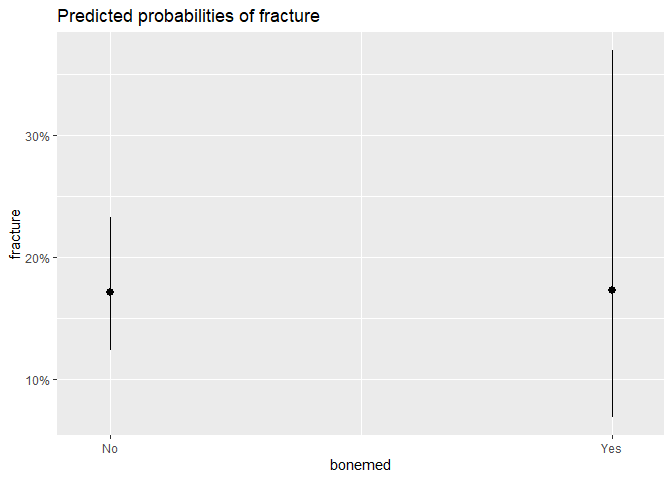

``` r
plot_model(red.model, type = "pred", terms = c("armassist","bonemed_fu"))
```

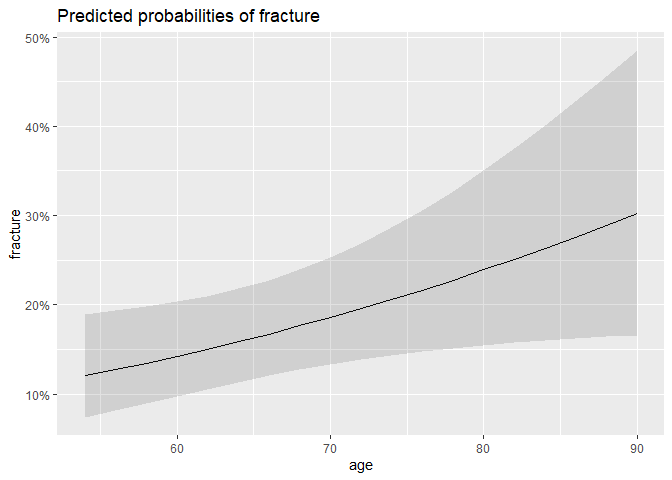

<hr>

# ROC Curve for Final Additive Model

<hr>
<h4>
Cross Validation & ROC Curve for Final Additive Model
</h4>

``` r
library(pROC)

# parameters for train function
fitControl <- trainControl( method = "repeatedcv", number = 5, repeats = 1, classProbs = T, summaryFunction = mnLogLoss)

# set seed for reproduceability 
set.seed(12)


# training CARET mult. logi. regression model 
base.adjust.cv <- train(fracture~age+priorfrac+height+momfrac+bonemed+bmi+bonemed_fu,
               data = training,
                trControl = fitControl,
                method = "glm",
                family = "binomial",
                metric = "logLoss")

summary(base.adjust.cv)
```

    ## 
    ## Call:
    ## NULL
    ## 
    ## Deviance Residuals: 
    ##     Min       1Q   Median       3Q      Max  
    ## -1.5591  -0.7545  -0.6050   0.1712   2.1111  
    ## 
    ## Coefficients:
    ##                 Estimate Std. Error z value Pr(>|z|)  
    ## (Intercept)   -4.7198537  3.8036530  -1.241   0.2147  
    ## age            0.0342221  0.0154401   2.216   0.0267 *
    ## priorfracYes   0.6183073  0.2886238   2.142   0.0322 *
    ## height        -0.0008537  0.0212201  -0.040   0.9679  
    ## momfracYes     0.5171833  0.3548087   1.458   0.1449  
    ## bonemedYes     0.0169533  0.5123700   0.033   0.9736  
    ## bmi            0.0332507  0.0223695   1.486   0.1372  
    ## bonemed_fuYes  0.6969686  0.5015108   1.390   0.1646  
    ## ---
    ## Signif. codes:  0 '***' 0.001 '**' 0.01 '*' 0.05 '.' 0.1 ' ' 1
    ## 
    ## (Dispersion parameter for binomial family taken to be 1)
    ## 
    ##     Null deviance: 395.31  on 350  degrees of freedom
    ## Residual deviance: 368.73  on 343  degrees of freedom
    ## AIC: 384.73
    ## 
    ## Number of Fisher Scoring iterations: 4

``` r
base.aic <- AIC(base.adj) # 384.7314

# make preds on the probabilty of each class in TRANING data
add.model.predprob <- predict(base.adjust.cv,test, type = "prob")

# compute the ROC curve
add.model.roc <- roc(response = test$fracture, predictor = add.model.predprob$Yes, levels = c("Yes","No"))

# optimal threshold
optimal.threshold <- coords(add.model.roc, "best")

# plot ROC curve
plot(add.model.roc, print.thres = "best",
     #print.thres.best.method = "closest.topleft",
     col = "red")
# add legend to plot
legend("bottomright",
       legend = 'Additive model',
       col = "red",
       lwd = 4, cex = 1, xpd = T, horiz = F)

text(x = optimal.threshold[1], y = optimal.threshold[2], 
     labels = paste("Optimal Threshold =", round(optimal.threshold[1], 2)), 
     pos = 3)
```

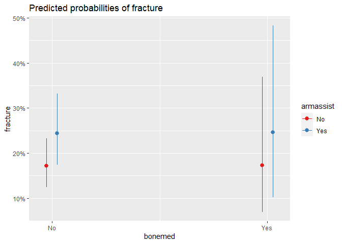

``` r
# get coord (threshold)
coords <- coords(add.model.roc, "best",
                 #best.method = "closest.topleft",
                 ret = "threshold")

# get optimal threshold
threshold <- coords[[1]] # currently this is 0.3003923

# make changes to threshold if desired
adj.threshold <- threshold + 0 # low incr. ses. 

# adjust the labeling by the desired threshold
pred_label <- as.factor(ifelse(add.model.predprob$Yes > adj.threshold, "Yes","No"))

# print confusion matrix
(cm1 <- confusionMatrix(pred_label, test$fracture, positive = "Yes"))
```

    ## Confusion Matrix and Statistics
    ## 
    ##           Reference
    ## Prediction No Yes
    ##        No  94  13
    ##        Yes 18  24
    ##                                          
    ##                Accuracy : 0.7919         
    ##                  95% CI : (0.7179, 0.854)
    ##     No Information Rate : 0.7517         
    ##     P-Value [Acc > NIR] : 0.1481         
    ##                                          
    ##                   Kappa : 0.4668         
    ##                                          
    ##  Mcnemar's Test P-Value : 0.4725         
    ##                                          
    ##             Sensitivity : 0.6486         
    ##             Specificity : 0.8393         
    ##          Pos Pred Value : 0.5714         
    ##          Neg Pred Value : 0.8785         
    ##              Prevalence : 0.2483         
    ##          Detection Rate : 0.1611         
    ##    Detection Prevalence : 0.2819         
    ##       Balanced Accuracy : 0.7440         
    ##                                          
    ##        'Positive' Class : Yes            
    ## 

``` r
cat("\nSensitivity:", cm1$byClass[1],
    "\nSpecificity:", cm1$byClass[2],
    "\nPrevalence:", cm1$byClass[8],
    "\nPositive Predicitve Value:", cm1$byClass[3],
    "\nNegative Predicive Value:",cm1$byClass[4],
    "\nAUROC:", add.model.roc$auc)
```

    ## 
    ## Sensitivity: 0.6486486 
    ## Specificity: 0.8392857 
    ## Prevalence: 0.2483221 
    ## Positive Predicitve Value: 0.5714286 
    ## Negative Predicive Value: 0.8785047 
    ## AUROC: 0.7919884

<h4>
Second Additive Model for Comparison
</h4>

``` r
# parameters for train function
fitControl <- trainControl( method = "repeatedcv", number = 5, repeats = 1, classProbs = T, summaryFunction = mnLogLoss)

# set seed for reproduceability 
set.seed(12)

# training CARET mult. logi. regression model 
add.model <- train(fracture~ armassist+age+bonemed_fu+bonemed,
                 data = training,
                 trControl = fitControl,
                 method = "glm",
                 family = "binomial",
                 metric = "logLoss")

summary(add.model)
```

    ## 
    ## Call:
    ## NULL
    ## 
    ## Deviance Residuals: 
    ##     Min       1Q   Median       3Q      Max  
    ## -1.3289  -0.7732  -0.6228   0.2660   2.0306  
    ## 
    ## Coefficients:
    ##                Estimate Std. Error z value Pr(>|z|)    
    ## (Intercept)   -3.716578   1.014492  -3.663 0.000249 ***
    ## armassistYes   0.444124   0.266632   1.666 0.095777 .  
    ## age            0.031982   0.014891   2.148 0.031732 *  
    ## bonemed_fuYes  0.735544   0.495698   1.484 0.137847    
    ## bonemedYes     0.007844   0.505190   0.016 0.987612    
    ## ---
    ## Signif. codes:  0 '***' 0.001 '**' 0.01 '*' 0.05 '.' 0.1 ' ' 1
    ## 
    ## (Dispersion parameter for binomial family taken to be 1)
    ## 
    ##     Null deviance: 395.31  on 350  degrees of freedom
    ## Residual deviance: 375.24  on 346  degrees of freedom
    ## AIC: 385.24
    ## 
    ## Number of Fisher Scoring iterations: 4

``` r
red.aic <- AIC(red.model) # 385.2419

# make preds on the probabilty of each class in TRANING data
add.model.predprob <- predict(add.model,test, type = "prob")

# compute the ROC curve
add.model.roc <- roc(response = test$fracture, predictor = add.model.predprob$Yes, levels = c("Yes","No"))

# optimal threshold
optimal.threshold <- coords(add.model.roc, "best")

# plot ROC curve
#plot(add.model.roc, print.thres = "best", print.thres.best.method = "closest.topleft", col = "red")
# add legend to plot
# legend("bottomright",
#        legend = 'caret model',
#        col = "red",
#        lwd = 4, cex = 1, xpd = T, horiz = F)
# text(x = optimal.threshold[1], y = optimal.threshold[2], 
#      labels = paste("Optimal Threshold =", round(optimal.threshold[1], 2)), 
#      pos = 1)

# get coord (threshold)
coords <- coords(add.model.roc, "best", best.method = "closest.topleft", ret = "threshold")

# get optimal threshold
threshold <- coords[[1]] # currently this is 0.2358135

# make changes to threshold if desired
adj.threshold <- threshold + 0

# adjust the labeling by the desired threshold
pred_label <- as.factor(ifelse(add.model.predprob$Yes > adj.threshold, "Yes","No"))

# print confusion matrix
#(cm2 <- confusionMatrix(pred_label, test$fracture, positive = "Yes"))

# cat("\nSensitivity:", cm2$byClass[1],
#     "\nSpecificity:", cm2$byClass[2],
#     "\nPrevalence:", cm2$byClass[8],
#     "\nPositive Predicitve Value:", cm2$byClass[3],
#     "\nNegative Predicive Value:",cm2$byClass[4],
#     "\nAUROC:", add.model.roc$auc)
```

<hr>

# Objective 2

<hr>

# Interaction EDA - Objective 2

<h4>
Investigating potential for interactions
</h4>

``` r
# age | bmi.cat 
df %>% ggplot(aes(x = age, y = fracture.num, color = bmi.cat)) +
  geom_point()+
  geom_smooth(method = "loess", size = 1, span = .75) +
  ylim(-.2, 1.2) + facet_wrap(~bmi.cat)
```


``` r
# height | bmi.cat
df %>% ggplot(aes(x = height, y = fracture.num, color = bmi.cat)) +
  geom_point()+
  geom_smooth(method = "loess", size = 1, span = .75) +
  ylim(-.2, 1.2) + facet_wrap(~bmi.cat)
```


``` r
# bmi | fracscore 
df %>% ggplot(aes(x = bmi, y = fracture.num, color = armassist)) +
  geom_point()+
  geom_smooth(method = "loess", size = 1, span = .75) +
  ylim(-.2, 1.2) + facet_wrap(~armassist)
```


``` r
# bmi | fracscore  
df %>% ggplot(aes(x = bmi, y = fracture.num, color = fracscore)) +
  geom_point()+
  geom_smooth(method = "loess", size = 1, span = .75) +
  ylim(-.2, 1.2) + facet_wrap(~fracscore)
```


``` r
# height | raterisk  
df %>% ggplot(aes(x = height, y = fracture.num, color = raterisk)) +
  geom_point()+
  geom_smooth(method = "loess", size = 1, span = .75) +
  ylim(-.2, 1.2) + facet_wrap(~raterisk)
```


``` r
# height | bonemed - potential interaction ?  
df %>% ggplot(aes(x = bmi, y = fracture.num, color = bonemed)) +
  geom_point(show.legend = F)+
  geom_smooth(method = "loess", size = 1, span = 1, show.legend = T) +
  ylim(-.2, 1.2) + facet_wrap(~bonemed) + ylab("Fracture") + xlab("Body Mass Index")
```

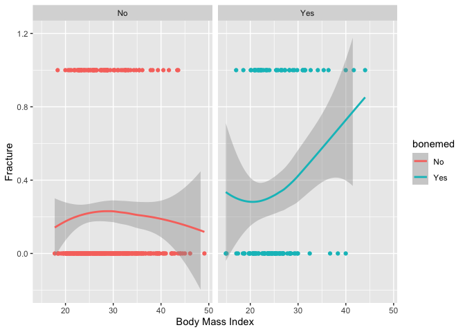

``` r
df %>% ggplot(aes(x = age, y = fracture.num, color = as.factor(fracscore))) + 
  geom_smooth(method = "loess", size = 1, span= .75) + 
  ylim(-.2,1.2) + facet_wrap(~as.factor(fracscore))
```

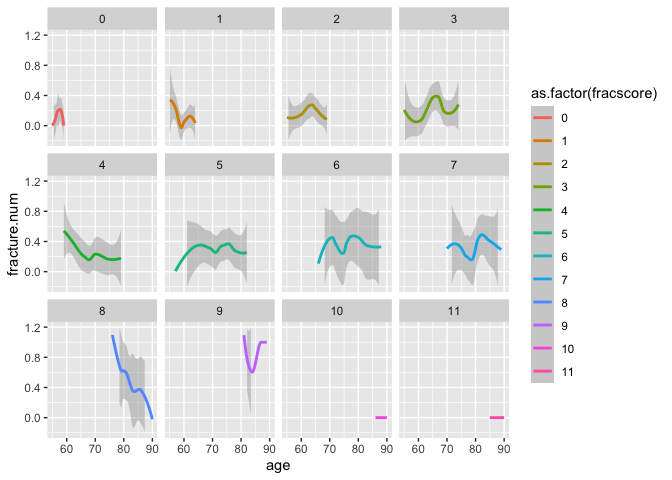

``` r
df %>% ggplot(aes(x = height, y = fracture.num, color = as.factor(bonemed)))+
  geom_smooth(method = "loess", size = 1, show.legend = T, span = 1) +
  ylim(-.2, 1.2) + facet_wrap(~bonemed) + ylab("Fracture") + xlab("Height in CM")
```


``` r
# bmi | priorfrac  
df %>% ggplot(aes(x = bmi, y = fracture.num, color = priorfrac )) +
  geom_point(show.legend = F)+
  geom_smooth(method = "loess", size = 1, span = 1, show.legend = T) +
  ylim(-.2, 1.2) + facet_wrap(~priorfrac)+ ylab("Fracture") + xlab("Body Mass Index")
```

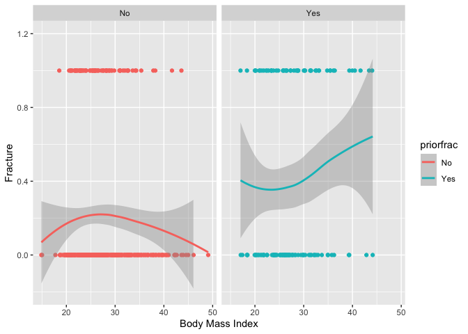

<h4>
Complex Model (Interactive Model)
</h4>

- The interaction qualification process began with visualizing various
  relationships to see if any visuals looked as if they would better be
  represented through interaction terms.

- The terms that we found were significant and actually made it into the
  model then were subject to trying out those visual relationship
  interactions.

- Interactions were added one at a time to determine their significance
  in the model (if they were significant) and how much they helped/hurt
  the model.

- if an interaction helped the model and was significant then it was
  kept, in this case it was height:bonemed_fu and bmi:bonemed.

# Complex Model 1

``` r
complex <- glm(fracture~age+priorfrac+height+momfrac+bonemed+bmi+bonemed_fu+
                 height:bonemed_fu+bonemed:bmi,
                data = training,
                family = "binomial")

complex.aic <- AIC(complex)
summary(complex)
```

    ## 
    ## Call:
    ## glm(formula = fracture ~ age + priorfrac + height + momfrac + 
    ##     bonemed + bmi + bonemed_fu + height:bonemed_fu + bonemed:bmi, 
    ##     family = "binomial", data = training)
    ## 
    ## Deviance Residuals: 
    ##      Min        1Q    Median        3Q       Max  
    ## -1.50928  -0.73283  -0.57208  -0.00166   2.23941  
    ## 
    ## Coefficients:
    ##                        Estimate Std. Error z value Pr(>|z|)   
    ## (Intercept)          -1.238e+01  4.906e+00  -2.523  0.01162 * 
    ## age                   3.550e-02  1.584e-02   2.241  0.02505 * 
    ## priorfracYes          6.956e-01  2.983e-01   2.332  0.01970 * 
    ## height                5.146e-02  2.833e-02   1.816  0.06937 . 
    ## momfracYes            4.877e-01  3.623e-01   1.346  0.17829   
    ## bonemedYes           -3.681e+00  1.669e+00  -2.206  0.02739 * 
    ## bmi                  -2.312e-04  2.687e-02  -0.009  0.99314   
    ## bonemed_fuYes         2.188e+01  7.838e+00   2.791  0.00525 **
    ## height:bonemed_fuYes -1.305e-01  4.851e-02  -2.690  0.00714 **
    ## bonemedYes:bmi        1.316e-01  5.857e-02   2.247  0.02462 * 
    ## ---
    ## Signif. codes:  0 '***' 0.001 '**' 0.01 '*' 0.05 '.' 0.1 ' ' 1
    ## 
    ## (Dispersion parameter for binomial family taken to be 1)
    ## 
    ##     Null deviance: 395.31  on 350  degrees of freedom
    ## Residual deviance: 354.42  on 341  degrees of freedom
    ## AIC: 374.42
    ## 
    ## Number of Fisher Scoring iterations: 4

``` r
# printing out all AIC metrics (note they are based on training data not test data)
# cat("\nbase.adj Model (Additive):", base.aic,
#     "\nRed Model (Additive):", red.aic,
#     "\nComplex Model:", complex.aic)
```

<h4>
Complex Model With Cross Validation
</h4>

``` r
# parameters for train function
fitControl <- trainControl( method = "repeatedcv", number = 5, repeats = 1, classProbs = T, summaryFunction = mnLogLoss)

# set seed for reproduceability 
set.seed(12)

# training CARET mult. logi. regression model 
complex.cv <- train(fracture~age+priorfrac+height+momfrac+bonemed+bmi+bonemed_fu+height:bonemed_fu+bonemed:bmi,
                 data = training,
                 trControl = fitControl,
                 method = "glm",
                 family = "binomial",
                 metric = "logLoss")

summary(complex.cv)
```

    ## 
    ## Call:
    ## NULL
    ## 
    ## Deviance Residuals: 
    ##      Min        1Q    Median        3Q       Max  
    ## -1.50928  -0.73283  -0.57208  -0.00166   2.23941  
    ## 
    ## Coefficients:
    ##                          Estimate Std. Error z value Pr(>|z|)   
    ## (Intercept)            -1.238e+01  4.906e+00  -2.523  0.01162 * 
    ## age                     3.550e-02  1.584e-02   2.241  0.02505 * 
    ## priorfracYes            6.956e-01  2.983e-01   2.332  0.01970 * 
    ## height                  5.146e-02  2.833e-02   1.816  0.06937 . 
    ## momfracYes              4.877e-01  3.623e-01   1.346  0.17829   
    ## bonemedYes             -3.681e+00  1.669e+00  -2.206  0.02739 * 
    ## bmi                    -2.312e-04  2.687e-02  -0.009  0.99314   
    ## bonemed_fuYes           2.188e+01  7.838e+00   2.791  0.00525 **
    ## `height:bonemed_fuYes` -1.305e-01  4.851e-02  -2.690  0.00714 **
    ## `bonemedYes:bmi`        1.316e-01  5.857e-02   2.247  0.02462 * 
    ## ---
    ## Signif. codes:  0 '***' 0.001 '**' 0.01 '*' 0.05 '.' 0.1 ' ' 1
    ## 
    ## (Dispersion parameter for binomial family taken to be 1)
    ## 
    ##     Null deviance: 395.31  on 350  degrees of freedom
    ## Residual deviance: 354.42  on 341  degrees of freedom
    ## AIC: 374.42
    ## 
    ## Number of Fisher Scoring iterations: 4

``` r
# make preds on the probabilty of each class in TRANING data
complexcv.predprob <- predict(complex.cv, test, type = "prob")

# compute the ROC curve
complexcv.roc <- roc(response = test$fracture, predictor = complexcv.predprob$Yes, levels = c("Yes","No"))

# plot ROC curve
plot(complexcv.roc, print.thres = "best", print.thres.best.method = "closest.topleft", col = "red")

# add legend to plot
legend("bottomright",
       legend = 'caret model',
       col = "red",
       lwd = 4, cex = 1, xpd = T, horiz = F)
```


``` r
# printing out all AIC metrics (note they are based on training data not test data)
cat("\nbase.adj Model (Additive):", base.aic,
    "\nRed Model (Additive):", red.aic,
    "\nComplex Model:", complex.aic)
```

    ## 
    ## base.adj Model (Additive): 383.1229 
    ## Red Model (Additive): 385.2419 
    ## Complex Model: 374.4221

``` r
# get coord (threshold)
coords <- coords(complexcv.roc, "best", best.method = "closest.topleft", ret = "threshold")

# get optimal threshold
threshold <- coords[[1]] # currently this is 0.25653

# make changes to threshold if desired
adj.threshold <- threshold + 0

# adjust the labeling by the desired threshold
pred_label <- as.factor(ifelse(complexcv.predprob$Yes >= adj.threshold, "Yes","No"))

# print confusion matrix
(cm3 <-confusionMatrix(pred_label, test$fracture, positive = "Yes"))
```

    ## Confusion Matrix and Statistics
    ## 
    ##           Reference
    ## Prediction No Yes
    ##        No  80  11
    ##        Yes 32  26
    ##                                           
    ##                Accuracy : 0.7114          
    ##                  95% CI : (0.6316, 0.7826)
    ##     No Information Rate : 0.7517          
    ##     P-Value [Acc > NIR] : 0.889791        
    ##                                           
    ##                   Kappa : 0.3504          
    ##                                           
    ##  Mcnemar's Test P-Value : 0.002289        
    ##                                           
    ##             Sensitivity : 0.7027          
    ##             Specificity : 0.7143          
    ##          Pos Pred Value : 0.4483          
    ##          Neg Pred Value : 0.8791          
    ##              Prevalence : 0.2483          
    ##          Detection Rate : 0.1745          
    ##    Detection Prevalence : 0.3893          
    ##       Balanced Accuracy : 0.7085          
    ##                                           
    ##        'Positive' Class : Yes             
    ## 

``` r
cat("\nSensitivity:", cm3$byClass[1],
    "\nSpecificity:", cm3$byClass[2],
    "\nPrevalence:", cm3$byClass[8],
    "\nPositive Predicitve Value:", cm3$byClass[3],
    "\nNegative Predicive Value:",cm3$byClass[4],
    "\nAUROC:", complexcv.roc$auc)
```

    ## 
    ## Sensitivity: 0.7027027 
    ## Specificity: 0.7142857 
    ## Prevalence: 0.2483221 
    ## Positive Predicitve Value: 0.4482759 
    ## Negative Predicive Value: 0.8791209 
    ## AUROC: 0.7326255

# GLM-NET Process

``` r
colnames(training)
```

    ##  [1] "sub_id"       "site_id"      "phy_id"       "priorfrac"    "age"         
    ##  [6] "weight"       "height"       "bmi"          "premeno"      "momfrac"     
    ## [11] "armassist"    "smoke"        "raterisk"     "fracscore"    "fracture"    
    ## [16] "bonemed"      "bonemed_fu"   "bonetreat"    "bmi.cat"      "fracture.num"

``` r
glm.df <- training[,-c(1:3,8,20)]
set.seed(12)

fitControl<- trainControl(method = "repeatedcv", number = 5, repeats = 1)

glm.fit <- train(fracture~.,
                 data = glm.df,
                 method = "glmnet",
                 trControl = fitControl)

glm.fit
```

    ## glmnet 
    ## 
    ## 351 samples
    ##  14 predictor
    ##   2 classes: 'No', 'Yes' 
    ## 
    ## No pre-processing
    ## Resampling: Cross-Validated (5 fold, repeated 1 times) 
    ## Summary of sample sizes: 282, 281, 280, 280, 281 
    ## Resampling results across tuning parameters:
    ## 
    ##   alpha  lambda        Accuracy   Kappa     
    ##   0.10   0.0001916456  0.7209862  0.05549091
    ##   0.10   0.0019164565  0.7324562  0.09703306
    ##   0.10   0.0191645646  0.7409081  0.08802049
    ##   0.55   0.0001916456  0.7209862  0.05549091
    ##   0.55   0.0019164565  0.7325378  0.08946719
    ##   0.55   0.0191645646  0.7381314  0.05372966
    ##   1.00   0.0001916456  0.7209862  0.05549091
    ##   1.00   0.0019164565  0.7325378  0.08946719
    ##   1.00   0.0191645646  0.7437238  0.04366690
    ## 
    ## Accuracy was used to select the optimal model using the largest value.
    ## The final values used for the model were alpha = 1 and lambda = 0.01916456.

``` r
plot(glm.fit)
```


``` r
opt.pen<- glm.fit$finalModel$lambdaOpt

coef(glm.fit$finalModel, opt.pen)
```

    ## 18 x 1 sparse Matrix of class "dgCMatrix"
    ##                              s1
    ## (Intercept)        -1.871291172
    ## priorfracYes        0.270161225
    ## age                 .          
    ## weight              .          
    ## height              .          
    ## premenoYes          .          
    ## momfracYes          0.003049722
    ## armassistYes        .          
    ## smokeYes            .          
    ## rateriskSame        .          
    ## rateriskGreater     0.301247919
    ## fracscore           0.124108029
    ## bonemedYes          .          
    ## bonemed_fuYes       0.400814380
    ## bonetreatYes        .          
    ## bmi.catObesity      .          
    ## bmi.catOverweight   0.020565675
    ## bmi.catUnderweight -0.511271527

# GLM-NET Additive Model:

- Using Feats from the code above we will fit the GLM model below.

``` r
# parameters for train function
fitControl <- trainControl( method = "repeatedcv", number = 5, repeats = 1, classProbs = T, summaryFunction = mnLogLoss)

# set seed for reproduceability 
set.seed(12)


# training CARET mult. logi. regression model 
red.glm <- train(fracture~priorfrac+momfrac+raterisk+fracscore+bonemed_fu+bmi.cat,
                 data = training,
                 trControl = fitControl,
                 method = "glm",
                 family = "binomial",
                 metric = "logLoss")

summary(red.glm)
```

    ## 
    ## Call:
    ## NULL
    ## 
    ## Deviance Residuals: 
    ##     Min       1Q   Median       3Q      Max  
    ## -1.5731  -0.7510  -0.5843   0.1723   2.1971  
    ## 
    ## Coefficients:
    ##                    Estimate Std. Error z value Pr(>|z|)    
    ## (Intercept)        -2.57444    0.39577  -6.505 7.77e-11 ***
    ## priorfracYes        0.29523    0.32780   0.901   0.3678    
    ## momfracYes          0.26554    0.36602   0.725   0.4681    
    ## rateriskSame        0.08463    0.32988   0.257   0.7975    
    ## rateriskGreater     0.56522    0.34535   1.637   0.1017    
    ## fracscore           0.17001    0.06270   2.712   0.0067 ** 
    ## bonemed_fuYes       0.64295    0.29825   2.156   0.0311 *  
    ## bmi.catObesity      0.46844    0.33180   1.412   0.1580    
    ## bmi.catOverweight   0.49246    0.32467   1.517   0.1293    
    ## bmi.catUnderweight -1.47320    1.16494  -1.265   0.2060    
    ## ---
    ## Signif. codes:  0 '***' 0.001 '**' 0.01 '*' 0.05 '.' 0.1 ' ' 1
    ## 
    ## (Dispersion parameter for binomial family taken to be 1)
    ## 
    ##     Null deviance: 395.31  on 350  degrees of freedom
    ## Residual deviance: 361.87  on 341  degrees of freedom
    ## AIC: 381.87
    ## 
    ## Number of Fisher Scoring iterations: 4

``` r
# make preds on the probabilty of each class in TRANING data
glm.predprob <- predict(red.glm, test, type = "prob")

# compute the ROC curve
glm.roc <- roc(response = test$fracture, predictor = glm.predprob$Yes, levels = c("Yes","No"))

# plot ROC curve
plot(glm.roc, print.thres = "best", print.thres.best.method = "closest.topleft", col = "red")
# add legend to plot
legend("bottomright",
       legend = 'caret model',
       col = "red",
       lwd = 4, cex = 1, xpd = T, horiz = F)
```


``` r
# fitting model for AIC below
red.glm <- glm(fracture~priorfrac+momfrac+raterisk+fracscore+bonemed_fu+bmi.cat,
                 data = training,family = "binomial")

red.glm.aic<-AIC(red.glm)

# printing out all AIC metrics (note they are based on training data not test data)
cat("\nbase.adj Model (Additive):", base.aic,
    "\nRed Model (Additive):", red.aic,
    "\nComplex Model:", complex.aic,
    "\nRed.GLM Model(additive):", red.glm.aic)
```

    ## 
    ## base.adj Model (Additive): 383.1229 
    ## Red Model (Additive): 385.2419 
    ## Complex Model: 374.4221 
    ## Red.GLM Model(additive): 381.8718

``` r
# get coord (threshold)
coords <- coords(glm.roc, "best", best.method = "closest.topleft", ret = "threshold")

# get optimal threshold
threshold <- coords[[1]] # currently this is 0.25653

# make changes to threshold if desired
adj.threshold <- threshold + 0

# adjust the labeling by the desired threshold
pred_label <- as.factor(ifelse(glm.predprob$Yes >= adj.threshold, "Yes","No"))

# print confusion matrix
(cm4 <- confusionMatrix(pred_label, test$fracture, positive = "Yes"))
```

    ## Confusion Matrix and Statistics
    ## 
    ##           Reference
    ## Prediction No Yes
    ##        No  74   7
    ##        Yes 38  30
    ##                                           
    ##                Accuracy : 0.698           
    ##                  95% CI : (0.6175, 0.7704)
    ##     No Information Rate : 0.7517          
    ##     P-Value [Acc > NIR] : 0.944           
    ##                                           
    ##                   Kappa : 0.3682          
    ##                                           
    ##  Mcnemar's Test P-Value : 7.744e-06       
    ##                                           
    ##             Sensitivity : 0.8108          
    ##             Specificity : 0.6607          
    ##          Pos Pred Value : 0.4412          
    ##          Neg Pred Value : 0.9136          
    ##              Prevalence : 0.2483          
    ##          Detection Rate : 0.2013          
    ##    Detection Prevalence : 0.4564          
    ##       Balanced Accuracy : 0.7358          
    ##                                           
    ##        'Positive' Class : Yes             
    ## 

``` r
cat("\nSensitivity:", cm4$byClass[1],
    "\nSpecificity:", cm4$byClass[2],
    "\nPrevalence:", cm4$byClass[8],
    "\nPositive Predicitve Value:", cm4$byClass[3],
    "\nNegative Predicive Value:",cm4$byClass[4],
    "\nAUROC:", glm.roc$auc)
```

    ## 
    ## Sensitivity: 0.8108108 
    ## Specificity: 0.6607143 
    ## Prevalence: 0.2483221 
    ## Positive Predicitve Value: 0.4411765 
    ## Negative Predicive Value: 0.9135802 
    ## AUROC: 0.7636342

# Complex GLM model

``` r
# parameters for train function
fitControl <- trainControl( method = "repeatedcv", number = 5, repeats = 1, classProbs = T, summaryFunction = mnLogLoss)

# set seed for reproduceability 
set.seed(12)


# training CARET mult. logi. regression model 
complex.glm <- train(fracture ~ site_id + priorfrac + momfrac + raterisk + fracscore + bonemed_fu + bmi.cat +
                       bonemed_fu:bmi.cat,
                     data = training,
                     trControl = fitControl,
                     method = "glm",
                     family = "binomial",
                     metric = "logLoss")

summary(complex.glm)
```

    ## 
    ## Call:
    ## NULL
    ## 
    ## Deviance Residuals: 
    ##     Min       1Q   Median       3Q      Max  
    ## -2.0259  -0.7461  -0.5593   0.1951   2.2540  
    ## 
    ## Coefficients:
    ##                                     Estimate Std. Error z value Pr(>|z|)    
    ## (Intercept)                         -2.77337    0.48794  -5.684 1.32e-08 ***
    ## site_id                              0.07613    0.07377   1.032  0.30208    
    ## priorfracYes                         0.28915    0.34138   0.847  0.39700    
    ## momfracYes                           0.36177    0.37164   0.973  0.33033    
    ## rateriskSame                         0.07166    0.33799   0.212  0.83210    
    ## rateriskGreater                      0.59024    0.35068   1.683  0.09235 .  
    ## fracscore                            0.16741    0.06395   2.618  0.00885 ** 
    ## bonemed_fuYes                        0.42248    0.44052   0.959  0.33753    
    ## bmi.catObesity                       0.10358    0.40527   0.256  0.79827    
    ## bmi.catOverweight                    0.63204    0.39550   1.598  0.11002    
    ## bmi.catUnderweight                   0.73072    1.48817   0.491  0.62341    
    ## `bonemed_fuYes:bmi.catObesity`       1.88230    0.80214   2.347  0.01895 *  
    ## `bonemed_fuYes:bmi.catOverweight`   -0.47575    0.68077  -0.699  0.48465    
    ## `bonemed_fuYes:bmi.catUnderweight` -16.24228  696.91054  -0.023  0.98141    
    ## ---
    ## Signif. codes:  0 '***' 0.001 '**' 0.01 '*' 0.05 '.' 0.1 ' ' 1
    ## 
    ## (Dispersion parameter for binomial family taken to be 1)
    ## 
    ##     Null deviance: 395.31  on 350  degrees of freedom
    ## Residual deviance: 348.11  on 337  degrees of freedom
    ## AIC: 376.11
    ## 
    ## Number of Fisher Scoring iterations: 14

``` r
# make preds on the probabilty of each class in TRANING data
complex.glm.predprob <- predict(complex.glm, test, type = "prob")

# compute the ROC curve
complex.glm.roc <- roc(response = test$fracture, predictor = complex.glm.predprob$Yes, levels = c("Yes","No"))

# plot ROC curve
plot(complex.glm.roc, print.thres = "best", print.thres.best.method = "closest.topleft", col = "red")

# add legend to plot
legend("bottomright",
       legend = 'GLM Complex',
       col = "red",
       lwd = 4, cex = 1, xpd = T, horiz = F)
```


``` r
complex.glm <- glm(fracture ~ priorfrac + momfrac + raterisk + fracscore + bonemed_fu + bmi.cat +
                       bonemed_fu:bmi.cat,
                 data = training,family = "binomial")

# AIC
complex.glm.aic<-AIC(complex.glm)

# printing out all AIC metrics (note they are based on training data not test data)
cat("\nbase.adj Model (Additive):", base.aic,
    "\nRed Model (Additive):", red.aic,
    "\nComplex Model:", complex.aic,
    "\nRed.GLM Model(additive):", red.glm.aic,
    "\nComplex.GLM:",complex.glm.aic)
```

    ## 
    ## base.adj Model (Additive): 383.1229 
    ## Red Model (Additive): 385.2419 
    ## Complex Model: 374.4221 
    ## Red.GLM Model(additive): 381.8718 
    ## Complex.GLM: 375.1716

``` r
# get coord (threshold)
coords <- coords(complexcv.roc, "best", best.method = "closest.topleft", ret = "threshold")

# get optimal threshold
threshold <- coords[[1]] # currently this is 0.25653

# make changes to threshold if desired
adj.threshold <- threshold + 0

# adjust the labeling by the desired threshold
pred_label <- as.factor(ifelse(complexcv.predprob$Yes >= adj.threshold, "Yes","No"))

# print confusion matrix
(cm5 <- confusionMatrix(pred_label, test$fracture, positive = "Yes"))
```

    ## Confusion Matrix and Statistics
    ## 
    ##           Reference
    ## Prediction No Yes
    ##        No  80  11
    ##        Yes 32  26
    ##                                           
    ##                Accuracy : 0.7114          
    ##                  95% CI : (0.6316, 0.7826)
    ##     No Information Rate : 0.7517          
    ##     P-Value [Acc > NIR] : 0.889791        
    ##                                           
    ##                   Kappa : 0.3504          
    ##                                           
    ##  Mcnemar's Test P-Value : 0.002289        
    ##                                           
    ##             Sensitivity : 0.7027          
    ##             Specificity : 0.7143          
    ##          Pos Pred Value : 0.4483          
    ##          Neg Pred Value : 0.8791          
    ##              Prevalence : 0.2483          
    ##          Detection Rate : 0.1745          
    ##    Detection Prevalence : 0.3893          
    ##       Balanced Accuracy : 0.7085          
    ##                                           
    ##        'Positive' Class : Yes             
    ## 

``` r
cat("\nSensitivity:", cm5$byClass[1],
    "\nSpecificity:", cm5$byClass[2],
    "\nPrevalence:", cm5$byClass[8],
    "\nPositive Predicitve Value:", cm5$byClass[3],
    "\nNegative Predicive Value:",cm5$byClass[4],
    "\nAUROC:", complex.glm.roc$auc)
```

    ## 
    ## Sensitivity: 0.7027027 
    ## Specificity: 0.7142857 
    ## Prevalence: 0.2483221 
    ## Positive Predicitve Value: 0.4482759 
    ## Negative Predicive Value: 0.8791209 
    ## AUROC: 0.7520512

# KNN - Non-parametric model

``` r
knn.df <- training[,-c(1)]

fitControl <- trainControl(method = "repeatedcv",number = 5, repeats = 1, classProbs = T, summaryFunction = mnLogLoss)

set.seed(12)

knn.model <- train(fracture~ .,
                   method = "knn",
                   data = knn.df,
                   trControl = fitControl,
                   metric = "logLoss")

preds <- predict(knn.model, test, type ="prob")[,"Yes"]

knn.roc <- roc(response = test$fracture, predictor = preds, levels = c("Yes","No"))

plot(knn.roc,print.thres = "best", print.thres.best.method = "closest.topleft", col = "purple")
```


``` r
plot(complexcv.roc, print.thres = "best", print.thres.best.method = "closest.topleft", col = "lightblue")
plot(glm.roc, print.thres = "best", print.thres.best.method = "closest.topleft", col = "black", add = T)
plot(complex.glm.roc, print.thres = "best", print.thres.best.method = "closest.topleft", col = "red", add = T)
plot(knn.roc,print.thres = "best", print.thres.best.method = "closest.topleft", col = "purple", add = T)
# add legend to plot
legend("bottomright",
       legend = c("Complex","GLM Additive",'GLM Complex', "KNN"),
       col = c("lightblue","black","red","purple"),
       lwd = 4, cex = 1, xpd = T, horiz = F)
```


``` r
# coords(complexcv.roc, "best", ret = c("threshold", "specificity", "sens"), transpose = F)
# coords(glm.roc, "best", ret = c("threshold","specificity","sens"), transpose = F)
# coords(complex.glm.roc, "best", ret = c("threshold","specificity","sens"), transpose=F)

threshold = .5
knn.preds <- factor(ifelse(preds > threshold, "Yes","No"))

(cm6 <- confusionMatrix(data = knn.preds, reference = as.factor(test$fracture), positive = "Yes"))
```

    ## Confusion Matrix and Statistics
    ## 
    ##           Reference
    ## Prediction  No Yes
    ##        No  100  35
    ##        Yes  12   2
    ##                                           
    ##                Accuracy : 0.6846          
    ##                  95% CI : (0.6035, 0.7582)
    ##     No Information Rate : 0.7517          
    ##     P-Value [Acc > NIR] : 0.974450        
    ##                                           
    ##                   Kappa : -0.067          
    ##                                           
    ##  Mcnemar's Test P-Value : 0.001332        
    ##                                           
    ##             Sensitivity : 0.05405         
    ##             Specificity : 0.89286         
    ##          Pos Pred Value : 0.14286         
    ##          Neg Pred Value : 0.74074         
    ##              Prevalence : 0.24832         
    ##          Detection Rate : 0.01342         
    ##    Detection Prevalence : 0.09396         
    ##       Balanced Accuracy : 0.47346         
    ##                                           
    ##        'Positive' Class : Yes             
    ## 

``` r
cat("\nSensitivity:", cm6$byClass[1],
    "\nSpecificity:", cm6$byClass[2],
    "\nPrevalence:", cm6$byClass[8],
    "\nPositive Predicitve Value:", cm6$byClass[3],
    "\nNegative Predicive Value:",cm6$byClass[4],
    "\nAUROC:", knn.roc$auc)
```

    ## 
    ## Sensitivity: 0.05405405 
    ## Specificity: 0.8928571 
    ## Prevalence: 0.2483221 
    ## Positive Predicitve Value: 0.1428571 
    ## Negative Predicive Value: 0.7407407 
    ## AUROC: 0.5874759

# LASSO Process

``` r
set.seed(12)

fitControl<- trainControl(method = "repeatedcv", number = 5, repeats = 1)

lambda_values <- seq(0,.03,by = .001)

lasso.fit <- train(fracture ~ .,
                 data = adj.training,
                 method = "glmnet",
                 trControl = fitControl,
                 tuneGrid = expand.grid(data.frame(alpha = 1, lambda = lambda_values)))

lasso.fit
```

    ## glmnet 
    ## 
    ## 351 samples
    ##  17 predictor
    ##   2 classes: 'No', 'Yes' 
    ## 
    ## No pre-processing
    ## Resampling: Cross-Validated (5 fold, repeated 1 times) 
    ## Summary of sample sizes: 282, 281, 280, 280, 281 
    ## Resampling results across tuning parameters:
    ## 
    ##   lambda  Accuracy   Kappa      
    ##   0.000   0.7181279   0.05660900
    ##   0.001   0.7182510   0.06059069
    ##   0.002   0.7182510   0.05335777
    ##   0.003   0.7240066   0.06767039
    ##   0.004   0.7268235   0.07196719
    ##   0.005   0.7296002   0.06852214
    ##   0.006   0.7296002   0.05918829
    ##   0.007   0.7352743   0.06918995
    ##   0.008   0.7381314   0.07536061
    ##   0.009   0.7381314   0.07536061
    ##   0.010   0.7409483   0.08007629
    ##   0.011   0.7352743   0.04894156
    ##   0.012   0.7352743   0.04894156
    ##   0.013   0.7381314   0.05372966
    ##   0.014   0.7381314   0.05372966
    ##   0.015   0.7381314   0.05372966
    ##   0.016   0.7380497   0.04408285
    ##   0.017   0.7408666   0.04984332
    ##   0.018   0.7408252   0.03889769
    ##   0.019   0.7408252   0.02769993
    ##   0.020   0.7408252   0.01643685
    ##   0.021   0.7408252   0.01643685
    ##   0.022   0.7408252   0.01643685
    ##   0.023   0.7408252   0.01643685
    ##   0.024   0.7408252   0.01643685
    ##   0.025   0.7408252   0.01643685
    ##   0.026   0.7408252   0.01643685
    ##   0.027   0.7436421   0.02163579
    ##   0.028   0.7436824   0.01130849
    ##   0.029   0.7408252  -0.00598352
    ##   0.030   0.7408252  -0.00598352
    ## 
    ## Tuning parameter 'alpha' was held constant at a value of 1
    ## Accuracy was used to select the optimal model using the largest value.
    ## The final values used for the model were alpha = 1 and lambda = 0.028.

``` r
plot(lasso.fit)
```

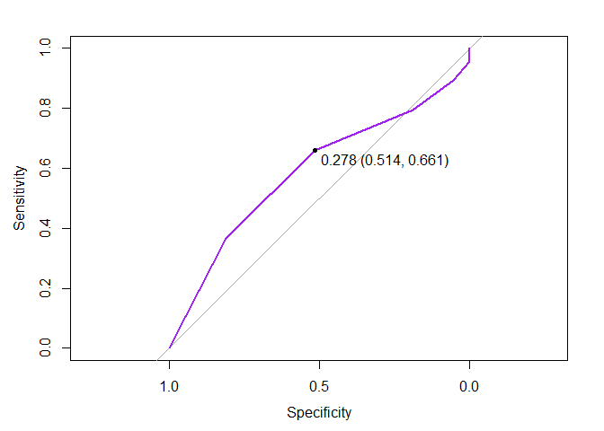

``` r
opt.pen<- lasso.fit$finalModel$lambdaOpt

coef(lasso.fit$finalModel, opt.pen)
```

    ## 21 x 1 sparse Matrix of class "dgCMatrix"
    ##                             s1
    ## (Intercept)        -1.74204979
    ## site_id             .         
    ## phy_id              .         
    ## priorfracYes        0.23031140
    ## age                 .         
    ## weight              .         
    ## height              .         
    ## bmi                 .         
    ## premenoYes          .         
    ## momfracYes          .         
    ## armassistYes        .         
    ## smokeYes            .         
    ## rateriskSame        .         
    ## rateriskGreater     0.22591433
    ## fracscore           0.10696891
    ## bonemedYes          .         
    ## bonemed_fuYes       0.32600450
    ## bonetreatYes        .         
    ## bmi.catObesity      .         
    ## bmi.catOverweight   .         
    ## bmi.catUnderweight -0.08213559

# LASSO Additive Model

``` r
lasso.model <- glm(fracture ~ priorfrac+ raterisk + bonemed_fu + fracscore + bmi.cat,
                   data = training,
                   family = "binomial")

summary(lasso.model)
```

    ## 
    ## Call:
    ## glm(formula = fracture ~ priorfrac + raterisk + bonemed_fu + 
    ##     fracscore + bmi.cat, family = "binomial", data = training)
    ## 
    ## Deviance Residuals: 
    ##     Min       1Q   Median       3Q      Max  
    ## -1.5492  -0.7398  -0.5852   0.2058   2.1811  
    ## 
    ## Coefficients:
    ##                    Estimate Std. Error z value Pr(>|z|)    
    ## (Intercept)        -2.56721    0.39521  -6.496 8.26e-11 ***
    ## priorfracYes        0.26995    0.32582   0.829  0.40737    
    ## rateriskSame        0.10806    0.32811   0.329  0.74189    
    ## rateriskGreater     0.60092    0.34146   1.760  0.07844 .  
    ## bonemed_fuYes       0.63246    0.29731   2.127  0.03340 *  
    ## fracscore           0.17789    0.06159   2.888  0.00387 ** 
    ## bmi.catObesity      0.44940    0.33049   1.360  0.17389    
    ## bmi.catOverweight   0.48249    0.32417   1.488  0.13666    
    ## bmi.catUnderweight -1.49052    1.16193  -1.283  0.19956    
    ## ---
    ## Signif. codes:  0 '***' 0.001 '**' 0.01 '*' 0.05 '.' 0.1 ' ' 1
    ## 
    ## (Dispersion parameter for binomial family taken to be 1)
    ## 
    ##     Null deviance: 395.31  on 350  degrees of freedom
    ## Residual deviance: 362.39  on 342  degrees of freedom
    ## AIC: 380.39
    ## 
    ## Number of Fisher Scoring iterations: 4

``` r
# checking for multicollinearity issues. 
vif(lasso.model) #no issues present
```

    ##                GVIF Df GVIF^(1/(2*Df))
    ## priorfrac  1.387965  1        1.178119
    ## raterisk   1.137489  2        1.032730
    ## bonemed_fu 1.151154  1        1.072918
    ## fracscore  1.396673  1        1.181809
    ## bmi.cat    1.161755  3        1.025304

``` r
# parameters for train function
fitControl <- trainControl( method = "repeatedcv", number = 5, repeats = 1, classProbs = T, summaryFunction = mnLogLoss)

# set seed for reproduceability 
set.seed(12)

# training CARET mult. logi. regression model 
lasso.model.cv <- train(fracture ~ priorfrac+ raterisk + bonemed_fu + momfrac + fracscore + bmi.cat,
                 data = training,
                 trControl = fitControl,
                 method = "glm",
                 family = "binomial",
                 metric = "logLoss")

#summary(base.adjust.cv)

base.aic <- AIC(lasso.model) # 381.87

# make preds on the probabilty of each class in TRANING data
add.model.predprob <- predict(lasso.model.cv,test, type = "prob")

# compute the ROC curve
add.model.roc <- roc(response = test$fracture, predictor = add.model.predprob$Yes, levels = c("Yes","No"))
```

    ## Setting direction: controls > cases

``` r
# optimal threshold
optimal.threshold <- coords(add.model.roc, "best")

# plot ROC curve
plot(add.model.roc, print.thres = "best",
     #print.thres.best.method = "closest.topleft",
     col = "red")
# add legend to plot
legend("bottomright",
       legend = 'Additive model',
       col = "red",
       lwd = 4, cex = 1, xpd = T, horiz = F)

text(x = optimal.threshold[1], y = optimal.threshold[2], 
     labels = paste("Optimal Threshold =", round(optimal.threshold[1], 2)), 
     pos = 3)
```

<!-- -->

``` r
# get coord (threshold)
coords <- coords(add.model.roc, "best",
                 #best.method = "closest.topleft",
                 ret = "threshold")

# get optimal threshold
threshold <- coords[[1]] # currently this is 0.3003923

# make changes to threshold if desired
adj.threshold <- threshold + .4 # lower increases sensitivity 

# adjust the labeling by the desired threshold
pred_label <- as.factor(ifelse(add.model.predprob$Yes > adj.threshold, "Yes","No"))

# print confusion matrix
(cm1 <- confusionMatrix(pred_label, test$fracture, positive = "Yes"))
```

    ## Confusion Matrix and Statistics
    ## 
    ##           Reference
    ## Prediction  No Yes
    ##        No  109  35
    ##        Yes   3   2
    ##                                           
    ##                Accuracy : 0.745           
    ##                  95% CI : (0.6672, 0.8128)
    ##     No Information Rate : 0.7517          
    ##     P-Value [Acc > NIR] : 0.6175          
    ##                                           
    ##                   Kappa : 0.0384          
    ##                                           
    ##  Mcnemar's Test P-Value : 4.934e-07       
    ##                                           
    ##             Sensitivity : 0.05405         
    ##             Specificity : 0.97321         
    ##          Pos Pred Value : 0.40000         
    ##          Neg Pred Value : 0.75694         
    ##              Prevalence : 0.24832         
    ##          Detection Rate : 0.01342         
    ##    Detection Prevalence : 0.03356         
    ##       Balanced Accuracy : 0.51363         
    ##                                           
    ##        'Positive' Class : Yes             
    ## 

``` r
cat("\nSensitivity:", cm1$byClass[1],
    "\nSpecificity:", cm1$byClass[2],
    "\nPrevalence:", cm1$byClass[8],
    "\nPositive Predicitve Value:", cm1$byClass[3],
    "\nNegative Predicive Value:",cm1$byClass[4],
    "\nAUROC:", add.model.roc$auc)
```

    ## 
    ## Sensitivity: 0.05405405 
    ## Specificity: 0.9732143 
    ## Prevalence: 0.2483221 
    ## Positive Predicitve Value: 0.4 
    ## Negative Predicive Value: 0.7569444 
    ## AUROC: 0.7636342

# LDA/QDA Assumption Checking

- The assumptions don’t look adequate for LDA/QDA model?
- Non-parametric (KNN) would be more adequate?

``` r
ggpairs(num.df)
```


``` r
colnames(num.df)
```

    ##  [1] "sub_id"       "site_id"      "phy_id"       "age"          "weight"      
    ##  [6] "height"       "bmi"          "fracscore"    "fracture.num" "raterisk.num"

``` r
num.df %>% ggplot(aes(x =age,y = weight, color = as.factor(fracture.num))) + 
  geom_point()+geom_density_2d()
```

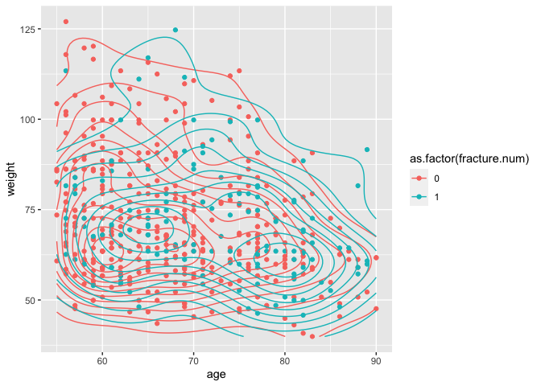

``` r
num.df %>% ggplot(aes(x = age, y = height, color = as.factor(fracture.num)))+
  geom_point() + geom_density_2d()
```


``` r
num.df %>% ggplot(aes(x = age, y = bmi, color = as.factor(fracture.num)))+
  geom_point() + geom_density_2d()
```

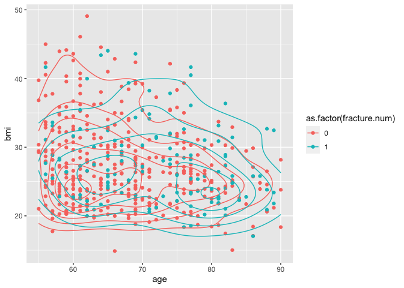

``` r
num.df %>% ggplot(aes(x = age, y = fracscore, color = as.factor(fracture.num)))+
  geom_point() + geom_density_2d()
```

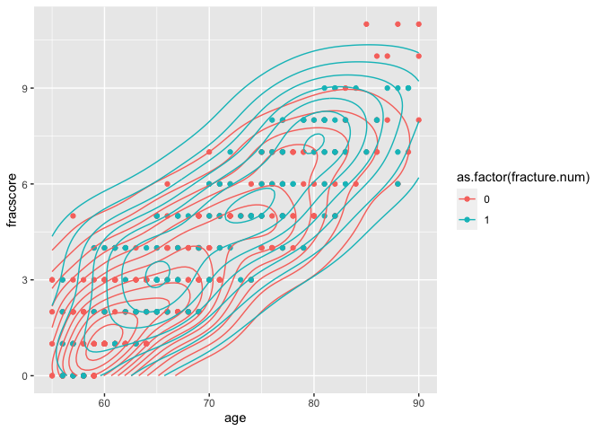

``` r
num.df %>% ggplot(aes(x = weight, y = height, color = as.factor(fracture.num)))+
  geom_point() + geom_density_2d()
```

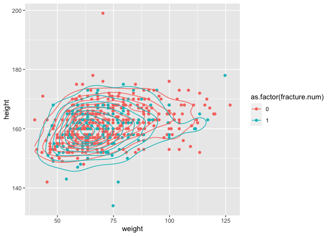

``` r
num.df %>% ggplot(aes(x = bmi, y = height, color = as.factor(fracture.num)))+
  geom_point() + geom_density_2d()
```


``` r
num.df %>% ggplot(aes(x = fracscore, y = height, color = as.factor(fracture.num)))+
  geom_point() + geom_density_2d()
```

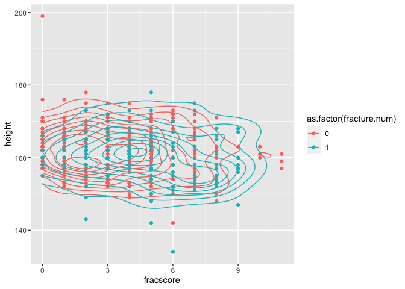

``` r
num.df %>% ggplot(aes(x = bmi, y = weight, color = as.factor(fracture.num)))+
  geom_point() + geom_density_2d()
```

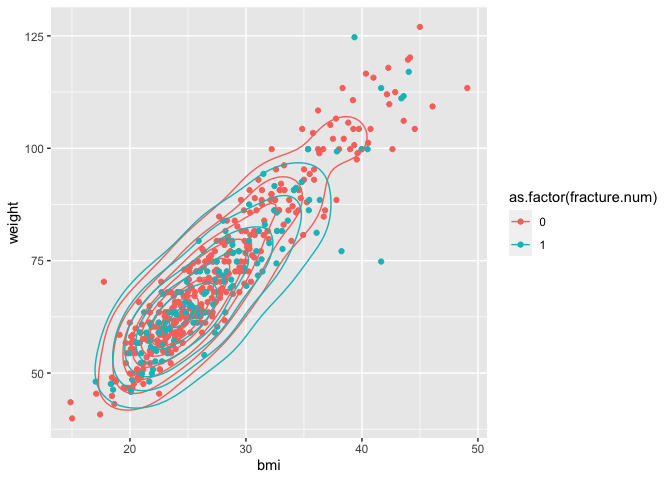

``` r
num.df %>% ggplot(aes(x = bmi, y = fracscore, color = as.factor(fracture.num)))+
  geom_point() + geom_density_2d()
```

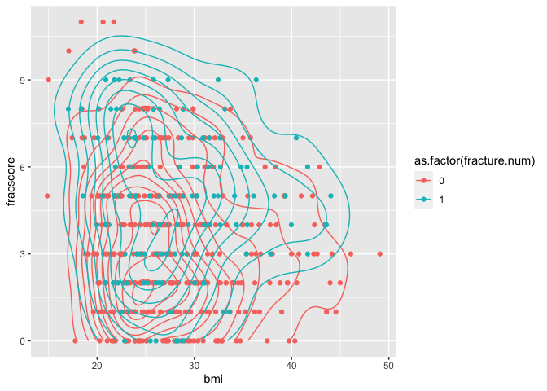

# QDA Model Additive

``` r
fitControl <- trainControl(method="repeatedcv",
                           number=5,
                           repeats=1,
                           classProbs=TRUE,
                           summaryFunction=mnLogLoss)
set.seed(12)
qda.fit <- train(fracture~age+weight+height+bmi+fracscore,
                 data = training,
                 method = "qda",
                 trControl = fitControl,
                 metric = "logLoss")

predictions <- predict(qda.fit, test, type = "prob")[,"Yes"]

threshold = .258
class_pred = as.factor(ifelse(predictions > threshold, "Yes","No"))

(cm7<-confusionMatrix(data = class_pred, reference = test$fracture, positive = "Yes"))
```

    ## Confusion Matrix and Statistics
    ## 
    ##           Reference
    ## Prediction No Yes
    ##        No  93  19
    ##        Yes 19  18
    ##                                           
    ##                Accuracy : 0.745           
    ##                  95% CI : (0.6672, 0.8128)
    ##     No Information Rate : 0.7517          
    ##     P-Value [Acc > NIR] : 0.6175          
    ##                                           
    ##                   Kappa : 0.3168          
    ##                                           
    ##  Mcnemar's Test P-Value : 1.0000          
    ##                                           
    ##             Sensitivity : 0.4865          
    ##             Specificity : 0.8304          
    ##          Pos Pred Value : 0.4865          
    ##          Neg Pred Value : 0.8304          
    ##              Prevalence : 0.2483          
    ##          Detection Rate : 0.1208          
    ##    Detection Prevalence : 0.2483          
    ##       Balanced Accuracy : 0.6584          
    ##                                           
    ##        'Positive' Class : Yes             
    ## 

``` r
qda.roc <- roc(response = test$fracture, predictor = predictions, levels = c("Yes","No"))

plot(qda.roc, print.thres = "best", col = "lightblue")
```


``` r
cat("\nSensitivity:", cm7$byClass[1],
    "\nSpecificity:", cm7$byClass[2],
    "\nPrevalence:", cm7$byClass[8],
    "\nPositive Predicitve Value:", cm7$byClass[3],
    "\nNegative Predicive Value:",cm7$byClass[4],
    "\nAUROC:", qda.roc$auc)
```

    ## 
    ## Sensitivity: 0.4864865 
    ## Specificity: 0.8303571 
    ## Prevalence: 0.2483221 
    ## Positive Predicitve Value: 0.4864865 
    ## Negative Predicive Value: 0.8303571 
    ## AUROC: 0.6645753

``` r
# 
# cat ("\nBase Additive Model PPV:","\n", cm1$byClass[3],"\n",
#      "\nReduced Additive Model PPV:","\n", cm2$byClass[3],"\n",
#      "\nComplex Model PPV:","\n", cm3$byClass[3],"\n",
#      "\nGLMNET Model PPV:","\n", cm4$byClass[3],"\n",
#      "\nComplex GLM Model PPV:","\n", cm5$byClass[3],"\n",
#      "\nKNN Model PPV:","\n", cm6$byClass[3],"\n",
#      "\nQDA Model PPV:","\n", cm7$byClass[3])
```
